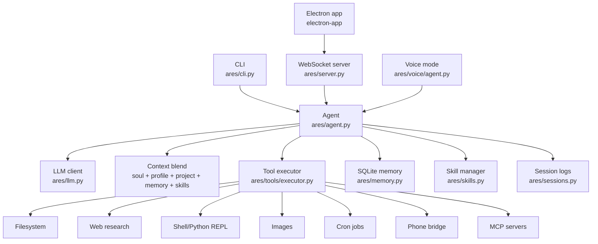

# Ares

**Ares is a terminal-first personal AI assistant with local memory, tool use, skills, scheduling, voice mode, phone control, and an Electron desktop client.**

It is built as a local-first assistant: it remembers useful facts, understands the current project, calls tools, runs repeatable skill workflows, and can operate from the terminal, a WebSocket server, voice mode, or the desktop app.

| Project | Status |
|---|---|
| Package | `ares` |
| Python | `>=3.11` |
| Desktop Node | `>=22.12.0` |
| Primary UI | Rich terminal CLI |
| Desktop UI | Electron + React |
| Test suite | `pytest` |
| License | MIT |
| Contributions | Pull requests welcome |


## Highlights

| Area | What Ares can do |
|---|---|
| Chat agent | Stream model responses, call tools, keep conversation context, and recover from tool loops. |
| Local memory | Store durable user facts in SQLite with FTS and vector search. |
| Skills | Auto-load relevant `SKILL.md` playbooks silently, similar to Claude Code/Codex-style skills. |
| Project context | Read repo guidance and project files such as `README.md`, `pyproject.toml`, `package.json`, `AGENTS.md`, and `CLAUDE.md`. |
| Filesystem tools | Read, search, write, edit, diff, backup, restore, hash, inspect, and batch-edit files. |
| Web research | Search the web, fetch URLs/PDF/text, label source quality, and summarize with citations. |
| Code execution | Run Python and shell commands through persistent REPL sessions. |
| Scheduling | Create, update, run, inspect, and log recurring cron jobs. |
| Voice | Optional STT/TTS with local and Sarvam/Edge backends. |
| Phone bridge | Android status, notifications, contacts, SMS, confirmed calls, app launch, URL open, ADB workflows. |
| Telegram channel | An allowlisted, persistent Telegram bridge for remote chat, file input, progress, and file delivery from the PC. |
| Desktop app | Electron + React chat UI, settings, sessions, status, tool cards, and terminal surface. |
| Windows control | Native app and desktop control through a restricted local Windows MCP integration. |

## Quick Start

```bash
git clone https://github.com/akyourowngames/friday.git
cd friday
pip install -e ".[dev]"
python -m ares
```

Run the test suite:

```bash
python -m pytest -q
```

Run the WebSocket server:

```bash
python -m ares --server
python -m ares --server --port 8766
ares-server
```

## Telegram Channel

Telegram runs from the same local Ares process and stores every remote chat in the existing local SQLite database. It uses long polling, so your PC does **not** need a public IP, a webhook, or port forwarding.

1. Create a bot with [@BotFather](https://t.me/BotFather), then run the local setup command. It accepts the token without echoing it and enables the channel:

```powershell
python -m ares --telegram-setup
```

   Alternatively, keep the token out of Ares' config by setting it only in the PC environment and enabling the channel in `~/.ares/config.json`:

```json
{
  "telegram": {
    "enabled": true,
    "allowed_chat_ids": []
  }
}
```

```powershell
$env:ARES_TELEGRAM_BOT_TOKEN = "123456:replace-with-your-token"
```

3. Start Ares once, open your bot in Telegram, and send `/start`. Ares replies with the chat ID but keeps the chat locked. On the PC, allow that exact ID:

```powershell
python -m ares --telegram-authorize 123456789
```

4. Start the Electron desktop app as usual (it starts the channel with its local server), or run a headless PC service:

```powershell
python -m ares --server
# or
python -m ares --telegram
```

An authorized chat can send normal messages, documents, and photos. `/new` starts a separate remote session, `/status` confirms the channel, and `/file C:\path\to\report.pdf` sends a local file back to that chat. Ares also uploads files it creates when the user explicitly asks it to send the result. Group chats remain disabled by default, and an unknown chat never gets tool access.

Run voice mode:

```bash
pip install -e ".[voice]"
python -m ares --voice
```

Run the desktop app:

```bash
cd electron-app
npm install
npm run dev
```

## How Ares Works



## Core Modules

| Module | Purpose |
|---|---|
| `ares/agent.py` | Main agent loop, tool execution, skill/context injection, and streaming. |
| `ares/cli.py` | Rich terminal UI, slash commands, tool status tables, and response rendering. |
| `ares/llm.py` | OpenAI-compatible model client. |
| `ares/memory.py` | SQLite memory store with keyword and vector retrieval. |
| `ares/context_blend.py` | Token budgeting and context assembly. |
| `ares/skills.py` | Skill discovery, parsing, linting, relevance scoring, and auto-loading. |
| `ares/tools/definitions.py` | Tool schemas exposed to the model. |
| `ares/tools/executor.py` | Tool dispatch and implementation wiring. |
| `ares/server.py` | WebSocket backend for the desktop app. |
| `ares/cron/` | Persistent recurring jobs and runner. |
| `ares/voice/` | Speech input/output subsystem. |
| `electron-app/` | Electron + React desktop client. |

## Tool Inventory

`ares/tools/definitions.py` registers the tool surface, and `ares/tools/executor.py` wires the handlers.

| Category | Tools |
|---|---|
| Memory | `store_memory`, `search_memory`, `update_memory`, `delete_memory` |
| Skills/export | `list_skills`, `load_skill`, `create_skill`, `export_data` |
| Web | `web_search`, `fetch_url` |
| Read-only filesystem | `read_file`, `search_files`, `list_directory`, `get_file_info`, `glob_pattern` |
| File editing | `write_file`, `edit_file`, `create_directory`, `delete_file`, `move_file`, `batch_edit`, `glob_apply`, `insert_line`, `replace_lines`, `delete_lines`, `preview_diff` |
| File utilities | `backup_file`, `undo_last_edit`, `batch_file_ops`, `find_text`, `append_to_file`, `prepend_to_file`, `compare_files`, `create_file_from_template`, `safe_path_status`, `disk_usage`, `checksum`, `copy_file`, `find_duplicates`, `tail_file`, `head_file`, `count_lines`, `file_tree` |
| Execution | `run_code`, `run_command`, `terminal_exec` |
| Images | `generate_image`, `image_info`, `resize_image`, `convert_image`, `crop_image` |
| Cron | `create_cron_job`, `list_cron_jobs`, `get_cron_job`, `update_cron_job`, `delete_cron_job`, `run_cron_job_now`, `get_cron_logs` |
| Phone | `phone_status`, `phone_get_notifications`, `phone_search_contact`, `phone_send_sms`, `phone_call_number`, `phone_launch_app`, `phone_open_url` |
| Windows desktop | MCP-powered screen snapshots, app launch/window control, mouse, keyboard, clipboard, and notifications. |
| Config/time | `update_config`, `get_current_datetime` |

## Skills

Ares supports local Agent Skills through `SKILL.md` files. Skills are internal execution guidance: Ares can auto-load relevant skills silently and complete the user request without asking whether it should use one.

| Scope | Location |
|---|---|
| User skills | `~/.ares/skills` |
| Project skills | `.ares/skills` |
| Agent-standard project skills | `.agents/skills` |
| Built-in skills | `ares/skills/` |

Built-in skills include:

| Skill | Category | Use case |
|---|---|---|
| `code-review` | coding | Review code for bugs, security issues, maintainability, tests, and conventions. |
| `codebase-summary` | coding | Summarize a repository, important files, language breakdown, and recent changes. |
| `project-init` | coding | Scaffold a new project with sensible files and verification. |
| `web-research` | research | Current web research with source checking and citations. |
| `research-deep-dive` | research | Multi-source research report generation. |
| `daily-planner` | productivity | Plan priorities, time blocks, constraints, and next actions. |
| `daily-standup` | productivity | Build a daily status summary. |
| `backup-snapshot` | utilities | Snapshot files/folders with checksum verification. |
| `image-batch-processor` | utilities | Batch resize, convert, rename, or optimize images. |
| `system-info` | utilities | Gather local debugging environment information. |
| `computer-use` | automation | Operate Windows desktop apps through MCP with fresh UI snapshots and post-action verification. |

## Slash Commands

| Command | Purpose |
|---|---|
| `/help` | Show command table. |
| `/memory` | Show recent memories. |
| `/memory search QUERY` | Search stored memories. |
| `/memory edit ID TEXT` | Update a memory. |
| `/memory delete ID` or `/forget ID` | Delete a memory. |
| `/model` or `/model list` | Show current and known models. |
| `/model MODEL` | Switch model and save config. |
| `/skills` | List installed skills. |
| `/skills search QUERY` | Search skills. |
| `/skills load NAME` | Show a skill's full instructions. |
| `/tools summary/details/hidden` | Control tool activity display. |
| `/mcp` | Show MCP management commands. |
| `/mcp status` | Show configured MCP server readiness and diagnostics. |
| `/mcp tools [SERVER]` | List discovered tools, optionally for one MCP server. |
| `/mcp reconnect SERVER` | Reconnect one MCP server and refresh its tools. |
| `/mcp health` | Probe connected MCP servers. |
| `/mcp reload` | Reload all MCP servers from shared config. |
| `/mcp config` | Show safe MCP configuration without private values. |
| `/phone status` | Check Android phone bridge health. |
| `/soul show/edit` | View or edit Ares' personality file. |
| `/profile show/edit` | View or edit the user profile file. |
| `/context` | Show active context. |
| `/setup` | Re-run onboarding. |
| `/export [PATH]` | Export local Ares data. |
| `/import PATH [--config]` | Import local Ares data. |
| `/reset` | Reset in-memory chat history. |
| `/exit` | Exit Ares. |

## Configuration and Data

| Path | Contents |
|---|---|
| `~/.ares/config.json` | Local user configuration. |
| `~/.ares/data/ares.db` | Memory, embeddings, conversations, summaries, and cron data. |
| `~/.ares/data/soul.md` | Ares personality file. |
| `~/.ares/data/profile.md` | User profile file. |
| `~/.ares/data/sessions/` | Per-session JSONL logs. |
| `~/.ares/data/mcp_tokens/` | MCP OAuth tokens. |
| `~/.ares/data/channels/telegram/inbox/` | Documents and media received from Telegram, held locally for the related turn. |
| `~/.ares/skills/` | User-installed skills. |
| `~/.ares_history` | CLI prompt history. |

### Windows Desktop Control

Ares uses [Windows-MCP](https://github.com/CursorTouch/Windows-MCP) locally through stdio. On its first run, `uvx` downloads the server; later runs use the local cache. The bundled configuration is deliberately restricted to UI interaction tools: snapshots, screenshots, mouse/keyboard input, app/window control, clipboard, and notifications. It does **not** grant the agent the MCP server's PowerShell, registry, or filesystem tools.

Use natural requests such as `open Spotify`, `inspect the Settings window`, or `click the Save button in the open app`. Ares observes the Windows accessibility tree first, then verifies major UI changes with a fresh snapshot. The MCP server controls the real desktop, so requests that send, submit, purchase, delete, share, or change system settings require explicit intent.

Environment variables can populate config in `ares/config.py`. JSON exports omit secret key fields.

See [MCP configuration and management](docs/mcp.md) for server examples, transport details, and diagnostics.

## Development

Install development dependencies:

```bash
pip install -e ".[dev]"
```

Run all tests:

```bash
python -m pytest -q
```

Run focused tests:

```bash
python -m pytest tests/test_skills.py tests/test_agent.py -q
```

Recommended checks before opening a pull request:

| Change type | Required check |
|---|---|
| Python behavior | Add/update tests and run `python -m pytest -q`. |
| Tool definitions or executor | Test schema/handler coverage and relevant integration tests. |
| Skills | Add/update skill tests and verify trigger behavior. |
| CLI rendering | Add/update CLI renderer tests. |
| Desktop app | Run relevant `npm` checks from `electron-app/` when UI code changes. |
| Docs only | Proofread links, commands, and examples. |

## Contributing

Contributions are welcome. Please read [CONTRIBUTING.md](CONTRIBUTING.md) before opening a pull request.

Core expectations:

| Rule | Meaning |
|---|---|
| Pull requests only | Do not push directly to the main project history. |
| Tests required | Every behavior change needs a test or a clear explanation for why testing is not applicable. |
| Deep review | Review the code path, edge cases, security implications, and user experience before requesting merge. |
| No surprise architecture changes | Large architecture changes need discussion first. Keep PRs focused and incremental. |
| Local-first privacy | Do not introduce unnecessary external data sharing. |

## Code of Conduct

This project follows [CODE_OF_CONDUCT.md](CODE_OF_CONDUCT.md). Be respectful, constructive, and serious about user safety.

## Privacy and Safety

- Ares stores memories, conversations, skills, config, cron data, soul, and profile files locally by default.
- Web search sends queries to configured search providers.
- Phone tools interact with a paired Android phone through KDE Connect and ADB.
- Shell, code, and filesystem tools run locally and can affect the local machine.
- Destructive file operations and real phone calls require explicit confirmation in tool schemas/handlers.
- Secrets should never be committed to the repository.

## Tech Stack

| Layer | Technology |
|---|---|
| Core | Python 3.11+, pydantic, httpx |
| Terminal UI | Rich, prompt_toolkit |
| Memory | SQLite, FTS5, sqlite-vec, sentence-transformers/ONNX |
| Web | Tavily/ddgs, fetch tooling |
| Images | Pillow, Pollinations.ai |
| Scheduling | croniter, dateparser, tzlocal |
| Voice | faster-whisper, Edge TTS, Sarvam AI, WebRTC VAD |
| Desktop | Electron, React, Zustand, Vite, xterm.js, node-pty |
| Integrations | MCP SDK, KDE Connect, ADB |

## License

MIT.
