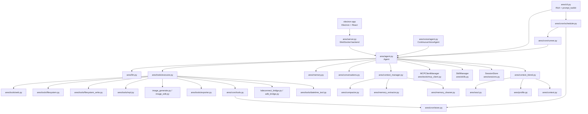

# Ares — Personal AI Assistant

Ares is a terminal-first personal AI assistant with local memory, local project context, tool calling, skills, cron jobs, voice mode, a WebSocket backend, and an Electron desktop client. This README describes what is implemented in the repository today.

## Implemented Features

- Natural language CLI backed by Rich and prompt_toolkit.
- OpenAI-compatible LLM client with streaming responses and tool calls.
- SQLite long-term memory with categories, metadata, FTS search, vector search, automatic extraction, deduplication, cleanup, and stale-memory pruning.
- Persistent conversations, compact summaries, per-session JSONL logs, and session identity management.
- Context assembly from soul, profile, project files, relevant memories, summaries, and skills.
- Project context discovery for repository files such as `AGENTS.md`, `CLAUDE.md`, `README.md`, `pyproject.toml`, and `package.json`.
- Local skill discovery and CRUD for `SKILL.md` playbooks.
- Web search through Tavily or ddgs plus URL fetching.
- Read-only filesystem tools, write/edit filesystem tools, batch edits, backups, undo, diffs, templates, file trees, hashes, duplicate detection, and line utilities.
- Persistent Python and shell REPL execution, shell command execution, and terminal-panel command execution.
- Image generation through Pollinations.ai and image info/resize/convert/crop through Pillow.
- JSON export/import for memories, conversations, and non-secret config.
- MCP client manager for configured MCP servers, with default Playwright, GitHub, and fetch server configs.
- Google Workspace bridge/server modules for Gmail and Calendar via OAuth tokens.
- Cron scheduling: create/list/get/update/delete jobs, run jobs now, read logs, background scheduler, runner, and toast notifications.
- Android phone bridge tools through KDE Connect and ADB for status, notifications, contacts, SMS, confirmed calls, app launch, and URL open.
- Android ADB MCP server for screenshots, file transfer, app install/uninstall, and shell commands.
- Atomic config updates via `update_config` tool (surgical field edits, no full rewrites).
- Voice mode with stricter VAD, local Whisper/Edge fallback, and optional Sarvam AI STT/TTS.
- WebSocket server for the Electron app.
- Electron + React desktop app with chat, sessions, settings, status, tool cards, and terminal UI.

## Tool Inventory

`ares/tools/definitions.py` registers 68 tools. `ares/tools/executor.py` wires handlers for all 68 of them; no definition/handler mismatches were found.

| Category | Tools |
|---|---|
| Memory | `store_memory`, `search_memory`, `update_memory`, `delete_memory` |
| Skills/export | `list_skills`, `load_skill`, `create_skill`, `export_data` |
| Web | `web_search`, `fetch_url` |
| Read-only filesystem | `read_file`, `search_files`, `list_directory`, `get_file_info`, `glob_pattern` |
| File writing/editing | `write_file`, `edit_file`, `create_directory`, `delete_file`, `move_file`, `batch_edit`, `glob_apply`, `show_file_with_line_numbers`, `insert_line`, `replace_lines`, `delete_lines`, `preview_diff`, `backup_file`, `undo_last_edit`, `batch_file_ops`, `find_text`, `append_to_file`, `prepend_to_file`, `compare_files`, `create_file_from_template`, `safe_path_status` |
| File utilities | `disk_usage`, `checksum`, `copy_file`, `find_duplicates`, `tail_file`, `head_file`, `count_lines`, `file_tree` |
| Code execution/terminal | `run_code`, `run_command`, `terminal_exec` |
| Images | `generate_image`, `image_info`, `resize_image`, `convert_image`, `crop_image` |
| Cron | `create_cron_job`, `list_cron_jobs`, `get_cron_job`, `update_cron_job`, `delete_cron_job`, `run_cron_job_now`, `get_cron_logs` |
| Phone | `phone_status`, `phone_get_notifications`, `phone_search_contact`, `phone_send_sms`, `phone_call_number`, `phone_launch_app`, `phone_open_url` |
| Config | `update_config` |
| Date/time | `get_current_datetime` |


## Architecture



## Core Components and Module Reference

### `ares/` modules

| File | What it does |
|---|---|
| `ares/__init__.py` | Ares — A personal AI assistant that lives in your terminal. |
| `ares/__main__.py` | Entry point: python -m ares |
| `ares/agent.py` | Core agent loop: LLM interaction, tool execution, context building. |
| `ares/cli.py` | Terminal UI using Rich and prompt_toolkit. |
| `ares/code_execution.py` | Backward-compatibility shim — moved to ares.tools.code_execution. |
| `ares/compactor.py` | Four-phase context compression following Hermes Agent pattern. |
| `ares/config.py` | Configuration management for Ares. |
| `ares/context.py` | Project context discovery from the current working directory. |
| `ares/context_blend.py` | Token estimation, truncation, and context blending utilities. |
| `ares/context_manager.py` | ContextManager — single entry point for all context lifecycle management. |
| `ares/conversations.py` | Persistent conversation storage and compact session summaries. |
| `ares/dates.py` | Backward-compatibility shim — moved to ares.tools.dates. |
| `ares/embeddings.py` | Embedding providers for Ares memory search. |
| `ares/exporter.py` | Backward-compatibility shim — moved to ares.tools.exporter. |
| `ares/filesystem.py` | Backward-compatibility shim — moved to ares.tools.filesystem. |
| `ares/filesystem_write.py` | Backward-compatibility shim — moved to ares.tools.filesystem_write. |
| `ares/image_edit.py` | Backward-compatibility shim — moved to ares.tools.image_edit. |
| `ares/image_generate.py` | Backward-compatibility shim — moved to ares.tools.image_generate. |
| `ares/llm.py` | LLM API client for OpenCode Zen (OpenAI-compatible). |
| `ares/memory.py` | Memory system: SQLite + sqlite-vec for vector search + FTS5 for keyword search. |
| `ares/memory_cleaner.py` | Memory cleanup: deduplication, merging, and stale memory pruning. |
| `ares/memory_extractor.py` | Extracts new memories from conversations using LLM judgment. |
| `ares/models.py` | Pydantic data models for Ares. |
| `ares/onboarding.py` | Interactive terminal onboarding wizard for first-time setup. |
| `ares/planner.py` | LLM-based task planner. Generates execution plans for auto-executable tasks. |
| `ares/profile.py` | Profile manager: user-owned identity, preferences, goals, and projects. |
| `ares/prompts.py` | System prompts and prompt templates for Ares. |
| `ares/reminders.py` | Runtime reminder checking and notification helpers. |
| `ares/renders.py` | Backward-compatibility shim — moved to ares.tools.renders. |
| `ares/server.py` | WebSocket server for the Ares desktop app. |
| `ares/session.py` | Session identity management. |
| `ares/sessions.py` | Per-session JSONL conversation storage. |
| `ares/shell_execution.py` | Backward-compatibility shim — moved to ares.tools.shell_execution. |
| `ares/skills.py` | Local Agent Skills discovery, parsing, and CRUD support. |
| `ares/soul.py` | Soul manager: user-owned personality definition for Ares. |
| `ares/sqlite_utils.py` | SQLite connection helpers shared by Ares stores. |
| `ares/tool_truncator.py` | Backward-compatibility shim — moved to ares.tools.tool_truncator. |
| `ares/web.py` | Backward-compatibility shim — moved to ares.tools.web. |

### `ares/tools/` modules

| File | What it does |
|---|---|
| `ares/tools/__init__.py` | Ares tools package — tool definitions and implementations. |
| `ares/tools/adb_bridge.py` | Small ADB bridge for Android phone status and call placement. |
| `ares/tools/code_execution.py` | Python code execution in isolated subprocess. |
| `ares/tools/dates.py` | Date/time helpers for user-facing task dates. |
| `ares/tools/datetime_tool.py` | Get current datetime as a tool for the agent. |
| `ares/tools/definitions.py` | Tool definitions in OpenAI function calling format. |
| `ares/tools/executor.py` | ToolExecutor — dispatches tool calls to local implementations. |
| `ares/tools/exporter.py` | JSON export/import helpers for Ares local data. |
| `ares/tools/filesystem.py` | Read-only file system operations for Ares. |
| `ares/tools/filesystem_write.py` | Write file system operations for Ares. |
| `ares/tools/google_mcp_bridge.py` | Google Workspace MCP bridge for Ares. |
| `ares/tools/google_mcp_server.py` | Standalone MCP server for Google Workspace (stdio transport). |
| `ares/tools/image_edit.py` | Image editing operations using Pillow (PIL). |
| `ares/tools/image_generate.py` | Image generation via Pollinations.ai (free, no API key). |
| `ares/tools/kdeconnect_bridge.py` | KDE Connect bridge for Android notifications, contacts, and SMS. |
| `ares/tools/mcp_client.py` | MCP client integration for Ares. |
| `ares/tools/renders.py` | Rich renderers for tool results. |
| `ares/tools/repl.py` | Persistent REPL sessions for stateful code and shell execution. |
| `ares/tools/shell_execution.py` | Shell command execution with output capture. |
| `ares/tools/tool_truncator.py` | Tool output truncation — keeps context lean by trimming large tool results. |
| `ares/tools/web.py` | Web search providers and summarization for Ares. |

### `ares/cron/` modules

| File | What it does |
|---|---|
| `ares/cron/__init__.py` | Cron job scheduling for Ares. |
| `ares/cron/runner.py` | Cron job runner that executes each run in a fresh Agent session. |
| `ares/cron/schedule_utils.py` | Cron schedule parsing and validation utilities. |
| `ares/cron/scheduler.py` | Async cron scheduler tick loop. |
| `ares/cron/store.py` | Persistent JSON store for scheduled cron jobs. |
| `ares/cron/toast.py` | Non-intrusive toast notifications for cron job completions. |
| `ares/cron/tools.py` | Tool handlers for managing cron jobs. |

### `ares/voice/` modules

| File | What it does |
|---|---|
| `ares/voice/__init__.py` | Voice input/output subsystem for Ares. |
| `ares/voice/agent.py` | Continuous voice mode entry point. |
| `ares/voice/player.py` | Audio playback helpers for voice responses. |
| `ares/voice/stt.py` | Local Whisper transcription helpers built around faster-whisper. |
| `ares/voice/tts.py` | Edge TTS speech synthesis wrapper. |
| `ares/voice/sarvam.py` | Sarvam AI STT/TTS adapters. |

## Built-in Skills

| Name | Category | Description |
|---|---|---|
| `export-backup` | ares | Export Ares local data with a timestamped backup and verify the generated file exists. |
| `memory-consolidator` | ares | Clean up Ares memories by finding duplicates, stale facts, contradictions, and better summaries. |
| `weekly-review` | ares | Review memories, conversations, and progress from the week, then summarize wins, blockers, and next priorities. |
| `code-review` | coding | Review code for bugs, security issues, maintainability, tests, and project conventions. Use when the user asks for a code review or PR check. |
| `codebase-summary` | coding | Analyze any codebase — tree view, language breakdown, file counts by type, largest files, recent changes. Use for "summarize this project", "explore this codebase", "what's in this repo". |
| `project-init` | coding | Scaffold a new project — create dirs, init git, write boilerplate (README, .gitignore, license), run first commit. Use when the user says "start a new project" or "scaffold". |
| `daily-planner` | productivity | Help plan a day with priorities, time blocks, constraints, reminders, and realistic next actions. |
| `daily-standup` | productivity | Compile a daily status — review recent conversations, active projects, calendar context if available, and store a memory snapshot. Use for "my daily standup", "what's on my plate", "daily summary", "status update". |
| `research-deep-dive` | research | Multi-source research on any topic — run targeted searches, fetch sources, evaluate quality, compile findings into a structured markdown report file. Use for "research X", "write a report on Y", "deep dive into Z". |
| `web-research` | research | Perform current web research with multiple source checks, source quality evaluation, and concise citations. Use for latest/current facts or recommendations. |
| `backup-snapshot` | utilities | Snapshot and verify important files or directories — copy with timestamp, checksum each file, verify integrity, report results. Use for "backup this folder", "snapshot these files", "backup with verification". |
| `image-batch-processor` | utilities | Batch process images in a folder — resize to common dimensions, convert between formats (PNG/JPEG/WebP), rename patterns. Use for "batch resize these images", "convert all PNGs to WebP", "optimize images in this folder". |
| `system-info` | utilities | Gather local OS, Python, shell, disk, and environment details for debugging Ares issues. |

## Slash Commands

These are the commands actually handled by `AresCLI._handle_command`.

| Command | Implemented behavior |
|---|---|
| `/help` | Show command table. |
| `/memory` | Show 10 recent memories. |
| `/memory search QUERY` | Search memories. |
| `/memory edit ID NEW_TEXT` | Update a memory's text. |
| `/memory delete ID` | Delete a memory. |
| `/forget ID` | Delete a memory by ID. |
| `/model` or `/model list` | Show current model and known free models. |
| `/model MODEL` | Switch model, save config, and update the agent. |
| `/clear` | Clear terminal screen. |
| `/setup` | Re-run onboarding wizard. |
| `/export [PATH]` | Export memories, conversations, and non-secret config to JSON. |
| `/import PATH [--config]` | Import memories/conversations, and optionally non-secret config. |
| `/reset` | Clear in-memory conversation history; memories remain. |
| `/soul [show]` | Show the soul/personality markdown. |
| `/soul edit` | Open or create the soul file in an editor. |
| `/profile [show]` | Show the user profile markdown. |
| `/profile edit` | Open or create the profile file in an editor. |
| `/context` | Show the active blended context. |
| `/skills` | List skills. |
| `/skills categories` | Show skill category counts. |
| `/skills search QUERY` | Search skills. |
| `/skills load NAME` | Render a skill's full instructions. |
| `/phone status` or `/phone` | Show phone bridge health when `phone.enabled` is true. |
| `/skill-name` | Load a skill directly if the slash name matches an installed skill. |
| `/exit` | Exit Ares. |

## Configuration

Config is stored at `~/.ares/config.json`. The current `AppConfig` defaults are:

```json
{
  "model": "deepseek-v4-flash-free",
  "api_key": "",
  "api_base_url": "https://opencode.ai/zen/v1",
  "max_context_messages": 20,
  "max_memory_retrieval": 5,
  "data_dir": "~/.ares/data",
  "embedding_model": "sentence-transformers/all-MiniLM-L6-v2",
  "embedding_backend": "onnx",
  "embedding_provider": "CPUExecutionProvider",
  "embedding_file_name": "",
  "reminder_poll_seconds": 30,
  "enable_desktop_notifications": true,
  "session_summary_messages": 2,
  "web_search_provider": "auto",
  "tavily_api_key": "",
  "tavily_search_depth": "basic",
  "soul_path": "",
  "profile_path": "",
  "project_context_enabled": true,
  "context_token_budget": 2000,
  "project_context_max_files": 2,
  "agent_max_iterations": 20,
  "context_compact_threshold": 0.9,
  "context_protected_tail": 20,
  "tool_output_max_chars": 500,
  "memory_dedup_threshold": 0.3,
  "memory_stale_days": 90,
  "memory_session_scope": 3,
  "memory_extract_enabled": true,
  "memory_cleanup_enabled": true,
  "skills_enabled": true,
  "skill_dirs": [
    "~/.ares/skills"
  ],
  "skill_auto_suggest": true,
  "mcp_servers": [
    {
      "name": "playwright",
      "transport": "stdio",
      "command": "npx",
      "args": [
        "@playwright/mcp@latest",
        "--browser",
        "chrome",
        "--caps",
        "vision,devtools",
        "--user-data-dir",
        "~/.ares/data/playwright-profile",
        "--viewport-size",
        "1280x720"
      ]
    },
    {
      "name": "github",
      "transport": "stdio",
      "command": "npx",
      "args": [
        "-y",
        "@modelcontextprotocol/server-github"
      ],
      "env": {
        "GITHUB_PERSONAL_ACCESS_TOKEN": ""
      }
    },
    {
      "name": "fetch",
      "transport": "stdio",
      "command": "uvx",
      "args": [
        "mcp-server-fetch"
      ]
    },
    {
      "name": "android-adb",
      "transport": "stdio",
      "command": "npx",
      "args": [
        "-y",
        "android-adb-mcp-server"
      ]
    }
  ],
  "voice": {
    "enabled": false,
    "stt_backend": "auto",
    "tts_backend": "auto",
    "tts_voice": "en-US-JennyNeural",
    "stt_model": "small",
    "stt_language": "",
    "mic_device": null,
    "min_utterance_ms": 650,
    "silence_timeout_ms": 700,
    "max_utterance_seconds": 20.0,
    "start_speech_frames": 5,
    "min_voiced_ms": 250,
    "min_audio_rms": 0.004,
    "barge_in_enabled": false,
    "post_speech_cooldown_ms": 1200,
    "tts_sample_rate": 24000,
    "tts_volume": 1.6,
    "sarvam_stt_model": "saaras:v3",
    "sarvam_tts_model": "bulbul:v3",
    "sarvam_language_code": "en-IN",
    "sarvam_speaker": "shubh",
    "sarvam_pace": 1.0
  },
  "phone": {
    "enabled": false,
    "kdeconnect_device_id": "",
    "adb_device_address": "",
    "store_notification_content": false,
    "kdeconnect_cli_path": "",
    "adb_path": ""
  },
  "cron_enabled": true,
  "cron_tick_seconds": 60,
  "cron_max_concurrent": 3,
  "cron_max_iterations": 10,
  "cron_log_retention_days": 90
}
```

Environment variables can also populate config in `ares/config.py`; JSON exports omit secret key fields.

## Persistence

| Path | Contents |
|---|---|
| `~/.ares/config.json` | User configuration. |
| `~/.ares/data/ares.db` | SQLite memories, embeddings/FTS data, conversations, summaries, and cron data. |
| `~/.ares/data/soul.md` | Default soul/personality file. |
| `~/.ares/data/profile.md` | Default user profile file. |
| `~/.ares/data/sessions/` | Per-session JSONL messages. |
| `~/.ares/data/mcp_tokens/` | MCP OAuth tokens. |
| `~/.ares/skills/` | User-installed skills. |
| `~/.ares_history` | CLI prompt history. |

## Quick Start

```bash
pip install -e .
python -m ares
```

### Server Mode

```bash
python -m ares --server
python -m ares --server --port 8766
ares-server
```

### Desktop App

```bash
pip install -e .
cd electron-app
npm install
npm run dev
```

### Voice Mode

```bash
pip install -e ".[voice]"
python -m ares --voice
python -m ares --voice --voice-name en-US-GuyNeural
python -m ares --voice --stt-backend sarvam --tts-backend sarvam
python -m ares --voice --barge-in
```

For Sarvam AI, set your API key outside the repo:

```powershell
$env:SARVAM_API_KEY = "your-key"
```

## Privacy Notes

- Ares stores memories, conversations, config, skills, cron data, soul, and profile files locally by default.
- Web search sends queries to Tavily or ddgs backends.
- Phone bridge tools interact with a paired Android phone through KDE Connect and ADB.
- Shell/code/file tools run locally with filesystem access; destructive file and call operations require explicit confirmation in their tool schemas/handlers.
- JSON exports omit secret API-key fields.

## Tech Stack

Python 3.11+, Rich, prompt_toolkit, pydantic, SQLite, sqlite-vec, sentence-transformers/ONNX Runtime with fallbacks, httpx, Tavily/ddgs, Pillow, MCP SDK, croniter/dateparser/tzlocal, websockets, faster-whisper, Edge TTS, Sarvam AI, WebRTC VAD, Electron, React, Zustand, Vite, xterm.js, and node-pty.

## Documentation Audit Notes

- Files mentioned in the previous README that no longer exist: none found in the referenced component paths.
- Existing implementation files now explicitly referenced above include all top-level `ares/*.py`, `ares/tools/*.py`, `ares/cron/*.py`, and `ares/voice/*.py` modules.
- `ares/prompts.py` mentions a smaller curated subset of tools by name rather than every registered tool; every mentioned tool is registered.

## License

MIT
