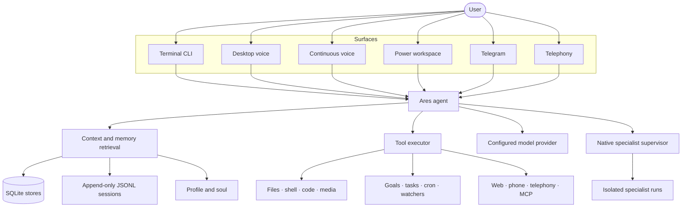

<div align="center">

# Ares

### A local-first personal AI assistant for terminal, desktop voice, web workspace, phone, and remote chat

[](pyproject.toml)
[](docs/mcp.md)
[](LICENSE)

**Remember context. Work through tools. Speak naturally. Keep durable data under your control.**

[Overview](#overview) · [Installation](#installation) · [Desktop voice](#desktop-voice) · [Runtime surfaces](#runtime-surfaces) · [Capabilities](#capability-map) · [Architecture](#architecture) · [Configuration](#configuration) · [Troubleshooting](#troubleshooting) · [Development](#development-and-verification)

</div>

---

## Overview

Ares is a multi-surface personal assistant built around one tool-using agent. It can run as a Rich terminal application, a background Windows desktop voice assistant, a continuous voice session, a local web workspace, an allowlisted Telegram bot, or a telephony gateway. Every surface shares the same configuration, memory, conversations, skills, integrations, and safety rules.

Ares is **local-first, not offline-only**. Its durable state lives under `~/.ares`, but model requests, web research, Telegram, telephony, and configured MCP servers may communicate with external services. Nothing in “local-first” implies that a cloud-backed capability runs locally.

<table>
  <tr>
    <td width="33%" valign="top"><h3>Recall</h3>Search durable facts, people, conversations, actions, and append-only session history with provenance.</td>
    <td width="33%" valign="top"><h3>Act</h3>Work with files, code, shell sessions, research, goals, watchers, images, vision, phones, and connected services.</td>
    <td width="33%" valign="top"><h3>Extend</h3>Add instruction-only <code>SKILL.md</code> playbooks and MCP servers without changing the core agent.</td>
  </tr>
</table>

### Highlights

- **Desktop voice assistant:** say “Hey Jarvis,” hold `Ctrl+Space` for push-to-talk, interrupt speech with your voice, and inspect tool or file results in the expandable activity panel.
- **Terminal command center:** slash completion, arrow-key menus, provider-aware model switching, searchable saved chats, and configurable tool-output detail.
- **Explainable local memory:** hybrid retrieval across facts, people, conversations, actions, and session archives with source IDs.
- **Power workspace:** local Next.js chat, uploads, settings, skills, MCP connections, watcher operations, and structured tool traces.
- **Native specialists:** bounded, isolated research, analysis, implementation, review, and synthesis runs with durable manifests.
- **Proactive operations:** goals, recurring jobs, durable workflows, watchers, incidents, and explicit evidence-based progress.
- **Extensible tool plane:** built-in tools, reusable local skills, and stdio/SSE/Streamable HTTP MCP integrations.
- **Remote surfaces:** an exact-chat allowlisted Telegram channel, Android bridge, and optional Twilio voice gateway.
- **Resilient local storage:** SQLite WAL, busy timeouts, retrying writes, shared connections, and atomic configuration saves.
- **Healthcare reporting pipeline:** end-to-end healthcare report generation with source retrieval, summarization, trend extraction, BI charts, and markdown/PDF output.
- **Semantic computer control:** intelligent desktop automation with UI element recognition, context-aware actions, and Windows MCP integration.
- **Model selection improvements:** streamlined provider/model switching with automatic endpoint alignment.

## Installation

### Requirements

- Python 3.11 or newer.
- Git for a source checkout.
- A supported model-provider account or token configured during `/setup`.
- Node.js only when developing the Next.js workspace from source.
- A working microphone and output device for voice modes.
- Windows 10/11 is the primary target for the desktop tray, global hotkeys, Windows-default microphone routing, and native desktop control.

### Base installation

```bash
git clone https://github.com/akyourowngames/friday.git
cd friday
python -m venv .venv
```

Activate the environment:

```powershell
# Windows PowerShell
.\.venv\Scripts\Activate.ps1
```

```bash
# macOS or Linux
source .venv/bin/activate
```

Install Ares and start the terminal:

```bash
pip install -e .
python -m ares
```

The first terminal run can launch the setup flow. You can reopen it at any time with `/setup`, then inspect or change the active provider and model with `/provider` and `/model`.

### Optional feature sets

| Extra | Install command | Adds |
|---|---|---|
| Development | `pip install -e ".[dev]"` | Pytest and asyncio test support. |
| Continuous voice | `pip install -e ".[voice]"` | Edge TTS, local wake-word runtime, audio I/O, and VAD. |
| Desktop UI | `pip install -e ".[voice,desktop]"` | Voice dependencies plus tray, CustomTkinter UI, and global hotkeys. |
| Vision | `pip install -e ".[vision]"` | Camera/screen capture, YOLO, OCR, and visual comparison providers. |
| Telephony | `pip install -e ".[telephony]"` | Twilio/voice-session dependencies. |
| GitHub Copilot | `pip install -e ".[copilot]"` | Optional Copilot SDK provider. |

Install multiple extras together when needed:

```bash
pip install -e ".[voice,desktop,vision,dev]"
```

### Model providers

Ares keeps the transport provider separate from the model family. Selecting a registered model automatically aligns the endpoint so, for example, an NVIDIA NIM model is not sent to the OpenCode Zen URL.

| Provider | Select with | Credential |
|---|---|---|
| OpenCode Zen | `/provider opencode` | `OPENCODE_API_KEY` or a provider-scoped key saved by setup. |
| NVIDIA NIM | `/provider nim` or `/provider nvidia` | `NIM_API_KEY` or `NVIDIA_API_KEY`. |
| GitHub Copilot | `/provider copilot` | User-authorized Copilot token; install the `copilot` extra. |

Use `/model` to browse models compatible with the active provider. Provider-specific keys are retained separately and are not intentionally forwarded to a different transport.

## Desktop voice

Install the combined voice and desktop extras, then launch the background assistant:

```bash
pip install -e ".[voice,desktop]"
python -m ares --desktop
```

Only one desktop instance may run at a time. Ares places the tray controller and audio coordinator in the background while the Tk interface runs in a dedicated child process, preventing the UI main loop from blocking audio, terminal, or other windows.

### Controls

| Action | Default control |
|---|---|
| Wake Ares hands-free | Say **“Hey Jarvis”**. |
| Push-to-talk | Hold `Ctrl+Space`, speak, then release. |
| Interrupt speech | Say “Hey Jarvis,” speak a new command, or press `Ctrl+Space` while Ares is talking. |
| Mute or unmute TTS | `Ctrl+Shift+M` or the tray menu. |
| Show or hide the panel | `Ctrl+Shift+H`, the tray icon, or **Open Ares**. |
| Enable/disable wake word | Tray menu. |
| Enable/disable interruption | Tray menu. |
| Start clean context | **New Session** in the tray menu. |
| Quit safely | **Quit** in the tray menu. |

### Voice pipeline

1. The local openWakeWord model continuously evaluates 16 kHz microphone frames for “Hey Jarvis.”
2. After activation, Ares opens a bounded command window and records until voice activity ends.
3. Local faster-whisper transcribes the request. With `desktop.translate_speech_to_english` enabled, Hindi, Hinglish, and other supported speech are translated into English command text.
4. The normal Ares agent runs with the same memory, tools, skills, MCP integrations, and conversation state used by the terminal.
5. Edge TTS speaks a sanitized response; paths, Markdown decoration, emoji, URLs, and noisy symbols are not read literally.
6. Barge-in monitors microphone speech during playback, stops TTS, preserves the opening interruption audio, and immediately captures the replacement command.

The desktop panel expands when work begins. It streams the transcript and response, shows tool start/progress/completion states, extracts file paths from structured tool results, and presents existing files as clickable rows.

### Microphone behavior

By default Ares follows the Windows default input device. It avoids Bluetooth microphone endpoints when `desktop.avoid_bluetooth_microphone` is enabled because narrow-band hands-free profiles often reduce wake-word and transcription quality. Set `voice.mic_device` to a PortAudio index or name only when you intentionally want to pin an endpoint.

The first local Whisper command can take longer while the model is loaded. Desktop mode warms the model in the background after wake-word capture has started.

### Continuous voice mode

For a terminal-owned, always-listening conversation without the desktop tray:

```bash
pip install -e ".[voice]"
python -m ares --voice
```

Useful overrides:

```bash
python -m ares --voice --voice-name en-US-GuyNeural
python -m ares --voice --barge-in
python -m ares --voice --no-barge-in
```

### Semantic computer control

Ares includes intelligent desktop automation capabilities that go beyond basic UI automation. The semantic computer control system understands application context, UI element relationships, and can execute complex multi-step workflows.

**Features:**
- **UI element recognition:** identifies buttons, text fields, menus, and other interactive elements
- **Context-aware actions:** understands what application is active and what actions are appropriate
- **Message sending workflows:** multi-step processes for sending messages through various applications
- **Windows MCP integration:** uses Windows MCP for reliable UI interaction and state management
- **Error recovery:** handles UI changes, element not found, and workflow interruptions

**Example workflows:**

```text
Send a WhatsApp message to John saying "Meeting at 3pm tomorrow."
Open Chrome and navigate to github.com/akyourowngames/friday.
Copy the selected text and paste it into the active document.
```

**How it works:**
1. Ares captures the current UI tree using Windows MCP
2. The semantic controller identifies relevant elements and their context
3. A multi-step workflow is planned and executed with error handling
4. Progress is monitored and adjustments are made if UI state changes

## Runtime surfaces

| Surface | Purpose | Command or address |
|---|---|---|
| Terminal | Interactive chat, slash commands, tools, setup, and diagnostics | `python -m ares` |
| Desktop voice | Tray assistant, “Hey Jarvis,” PTT, interruption, and activity panel | `python -m ares --desktop` |
| Continuous voice | Always-listening terminal voice session | `python -m ares --voice` |
| Unified runtime | API, workspace, watchers, integrations, and enabled Telegram channel | `python -m ares --all` |
| WebSocket API | Local client protocol | `ws://127.0.0.1:8765` |
| Power workspace | Local operational web UI | `http://127.0.0.1:8766` |
| Watcher console | Fleet, checks, incidents, and delivery telemetry | `http://127.0.0.1:8080` |
| Telegram | Remote allowlisted chat within the unified runtime | `python -m ares --all` |
| Telegram multi-bot | Multiple bots in one group, @mention routing | `python -m ares --telegram-multi` |
| Twilio webhook | Signed inbound Voice/status callbacks | `python -m ares --telephony-webhook` |
| Twilio media gateway | Bidirectional Media Streams over a published WSS endpoint | `python -m ares --telephony-media-gateway` |

### Unified runtime

```bash
python -m ares --all
# Desktop API: ws://127.0.0.1:8765
# Power workspace: http://127.0.0.1:8766
# Advanced watcher console: http://127.0.0.1:8080
```

`--all` owns one agent, integration manager, watcher scheduler, Next.js power workspace, watcher console, WebSocket API, and Telegram channel when enabled. `--server` and `--telegram` remain compatibility aliases for the same unified runtime.

### Local Vision V1

Ares can inspect a user-provided image directly and can observe a local camera or screen only after explicit per-source consent. It supports local object detection, OCR, scene events, visual comparisons, evidence-based verification, bounded watches, and opt-in visual memory.

Install the optional local CV/OCR providers when you need camera or screen capture, object detection, or OCR:

```bash
pip install -e ".[vision]"
```

Camera and screen capture are disabled by default. Ares requires an explicit observation grant to activate a source, shows active-source state, redacts sensitive text from stored metadata, and does not retain frames unless you separately configure retention. Visual events are evidence—not automatic goal completion or external action.

Example prompts:

```text
Describe this image and read the visible text.
With my permission, watch this screen for a successful build message.
Compare this new photo with the previous snapshot and tell me what changed.
Verify whether the package label is visible; say uncertain if the evidence is weak.
```

### Power workspace

The power workspace is intentionally separate from the public marketing website. It provides one operational surface for streaming Ares chat, reusable file uploads, skills, MCP connections, watcher fleet management, personalization, browser configuration, Telegram setup, and advanced runtime settings. Chat, watcher actions, MCP operations, and settings all use the same running Ares agent and WebSocket protocol.

The production build is bundled with the Python package and served at `http://127.0.0.1:8766` by `python -m ares --all`. For frontend development:

```bash
cd ares-workspace
npm install
npm run dev
```

`npm run build` creates the static Next.js export and synchronizes it into `ares/workspace/static` for the Python runtime. The packaged static build is already served by `python -m ares --all`; Node.js is required only for frontend development.

### Native multi-agent mode

Multi-agent mode is enabled conservatively by default. Native agents are independent specialist model loops with real child run/session IDs and a durable execution manifest. Parallel tool calls remain one agent, and durable `create_task`/`run_task` workflows remain zero agents. Ares never presents either mechanism as a specialist team.

Routing is deterministic and based only on the current turn. An explicit request for agents must launch a bounded native plan or say why zero agents ran; it cannot silently fall back to a workflow. Ares can also delegate useful independent workstreams automatically, while greetings, thanks, one lookup, small edits, and agent meta-questions stay single-agent. “How many agents did you use?” reads the latest manifest for that session instead of opening a browser or trusting earlier prose.

Every child has an isolated history/session, unique run ID, bounded assignment/dependency context, role-specific tool allowlist, independent capability grants, and its own model/iteration/timeout budget. Personal/global context and automatic skills are excluded by default. Consequential child actions require an exact root-issued, expiring, single-use grant bound to the root, child, request, tool, and argument hash. Overlapping writes and stateful browser/shell/Python operations serialize; multiple builders use detached worktrees when safe, return reviewable patch artifacts, and only root-side sequential application follows an explicit reviewer approval. Dirty or unsupported repositories share one live-tree mutation lock.

The chat workspace renders the session-owned manifest with roles, dependency waves, elapsed time, current tool, sources, results, artifacts, partial failures, synthesis, and cancellation. WebSocket and Telegram events, artifacts, run lookup, and cancellation are filtered to the selected conversation/chat.

Example prompts:

- “Research three approaches in parallel and compare them.”
- “Inspect the backend and frontend separately, then create an implementation plan.”
- “Have a builder implement this feature and a reviewer verify the changes.”
- “Analyze this bug using a code analyst, documentation researcher, and verifier.”

Terminal controls:

```text
/agents status
/agents active
/agents roles
/agents runs [LIMIT]
/agents show RUN_ID
/agents cancel RUN_ID
/agents resume RUN_ID
/agents run REQUEST
/agents doctor
/agents smoke-test
/agents on
/agents off
```

`/agents doctor` is local and model-free. `/agents run` and `/agents smoke-test` launch real configured specialists and can use provider quota. For the deterministic offline acceptance suite (fake executors, no model/browser/network/API), run:

```bash
python -m ares.multi_agent_smoke
python -m pytest -q -p no:cacheprovider tests/test_multi_agent_smoke.py
```

Configuration, lifecycle, failure behavior, safety, truthful counting, and operations are documented in [Native multi-agent mode](docs/multi-agent.md). Maintainers should also read [Multi-agent architecture](docs/multi-agent-architecture.md).

> [!TIP]
> Start in the terminal first. Use `/setup`, `/model`, `/context`, and `/help` to inspect the active configuration and available controls.

---

## Healthcare reporting pipeline

Ares includes a complete healthcare reporting pipeline that can retrieve medical sources, summarize findings, extract trends, generate BI charts, and assemble professional markdown reports with optional PDF conversion.

### Features

- **Source retrieval:** pulls healthcare data from configured sources and validates source quality
- **Intelligent summarization:** extracts key findings, trends, contradictions, and knowledge gaps
- **BI chart generation:** automatically creates line, bar, or pie charts based on data shape
- **Report assembly:** builds structured markdown reports with required sections (Summary, Key Findings, Sources)
- **Validation:** ensures report completeness and chart artifact integrity
- **Optional conversion:** PDF/DOCX output when pandoc is available

### Usage

```text
Generate a healthcare report on diabetes trends with charts.
Create a comprehensive report on cardiovascular disease statistics.
Produce a healthcare analysis comparing treatment outcomes across regions.
```

### Output structure

Reports are saved to `~/.ares/data/healthcare-reports/` with:
- Structured markdown with required sections
- Embedded or referenced chart images
- Source citations and confidence levels
- Trend analysis and uncertainty documentation

### Healthcare skills

| Skill | Purpose |
|---|---|
| `healthcare-reporting` | End-to-end report generation with charts |
| `healthcare-retrieval` | Source discovery and validation |
| `healthcare-summarization` | Findings extraction and trend analysis |

---

## Proactive watchers

Ares can run a durable monitoring fleet over websites, REST/JSON APIs, numeric thresholds, permitted Instagram Graph API endpoints, authenticated Playwright pages, and the results of existing Ares or connected MCP tools. Watchers are part of the normal agent tool plane: you can ask Ares to create, inspect, run, pause, resume, or query them in natural language.

The control plane is local by default and includes:

- A real-time overview, fleet health, incident queue, latency telemetry, delivery-channel health, and persistent settings.
- SHA-256, text diff, and numeric threshold detection with regex noise suppression and first-run baselines.
- Concurrent scheduling, cross-process leases, bounded fetch timeouts, exponential retry backoff, auto-pause after repeated failures, and snapshot retention.
- Telegram, desktop, email, and webhook delivery with per-channel attempt logs and background retries.
- Optional Ares analysis for suggestions and explicit, auditable webhook-only automatic actions.
- SSRF protection, private-network opt-in, cross-origin redirect controls, secret redaction, and optional `ARES_WATCHER_API_TOKEN` dashboard authentication.
- Bounded read-only tool workflows that reuse phone, files, web, browser, and MCP integrations. Consequential steps such as clicks, typing, sending, deletion, or shell execution require global and per-watcher opt-in.

Examples you can ask Ares directly:

```text
Monitor my Instagram DMs every 5 minutes using my authenticated Playwright session.
Watch my Android notifications and alert me when a new banking notification appears.
Create a watcher over the GitHub MCP tool result for open production incidents.
Show failing watchers and acknowledge the incident from the deployment-status watcher.
Run the Instagram inbox watcher now and tell me what changed.
```

The agent exposes `create_watcher`, `list_watchers`, `get_watcher`, `update_watcher`, `run_watcher_now`, fleet/event query tools, pause/resume, acknowledgement, capability discovery, and confirmed deletion. Use `get_watcher_capabilities` when Ares needs to inspect the currently connected MCP tools before building a workflow.

### Goal-aware watcher signals

Watchers can be linked to one or many durable goals. Pass `goal_id` to `create_watcher` for a one-step setup, or use `link_goal_watcher` later. Every detected change is fanned out idempotently using the watcher event UUID and stored in `goal_watcher_signals` with severity, old/new values, source provenance, snooze state, resolution, and surface count.

A signal never changes goal progress or status. It appears in goal context for at most three turns during its first 48 hours, then remains available through `get_goal_signals` or `/goals signals` without nagging. The user can snooze or dismiss it, or explicitly confirm an `update_goal`/`complete_goal` call with `resolves_signal_id`; that mutation and signal acknowledgement share one SQLite transaction. Once every goal-specific copy is resolved, Ares reconciles the originating watcher incident too.

See [`docs/goal-watcher-integration.md`](docs/goal-watcher-integration.md) for the runtime sequence, persistence contract, anti-nag rules, and operator examples.

```text
Create a goal to buy a laptop under $1,000, then watch this product page and link it.
Show pending watcher signals for my laptop goal.
Not now—snooze signal 12 for two days.
Yes, the price is low enough; complete the goal and resolve signal 12.
```

For authenticated DMs, configure `/browser extension` or `/browser system`, sign in normally, and let the browser watcher navigate to or snapshot the inbox. Ares stores the captured signal—not your password—and never automates credential entry. The dashboard’s **Browser / DMs (Playwright)** source includes an Instagram inbox starter recipe; **Ares tool workflow** provides a visible JSON workflow editor for any read-only tool chain.

Terminal controls use short IDs or exact names:

```text
/monitor add "Production status" https://status.example.com --interval 5m --type website
/monitor add "Laptop price" https://shop.example.com/laptop --interval 15m --goal 12
/monitor list
/monitor status ID
/monitor pause ID
/monitor resume ID
/monitor events ID
/monitor test ID
/monitor remove ID
```

Telegram exposes `/monitors`, `/monitor ...`, and `/alerts`. The scheduler starts automatically in Ares when `watcher.enabled` is true. Use `python -m ares --all` for the unified always-on runtime; database leases remain as a defensive guarantee against duplicate checks during upgrades or accidental overlapping processes.

Watcher configuration is stored under the shared `watcher` object in `~/.ares/config.json`. Notification passwords and bot tokens can remain outside the file through `ARES_WATCHER_SMTP_PASSWORD` and `ARES_TELEGRAM_BOT_TOKEN`.

```json
{
  "watcher": {
    "enabled": true,
    "tool_monitors_enabled": true,
    "allow_mutating_tool_steps": false,
    "max_tool_steps": 8,
    "dashboard": { "enabled": true, "host": "127.0.0.1", "port": 8080 }
  }
}
```

Keep `allow_mutating_tool_steps` off for normal monitoring. Enabling a consequential workflow also requires `"allow_mutating_tools": true` on that specific watcher, and should only be used for an explicitly reviewed automation. Respect the monitored service’s permissions and terms.

---

## Multi-bot Telegram

Run multiple Ares bots in a single Telegram group. Each bot has its own agent, conversation history, and responds only when @mentioned.

### Setup

```bash
# Interactive setup
python -m ares --telegram-multi-setup

# Or configure manually in ~/.ares/config.json
```

### Configuration

```json
{
  "telegram_multi": {
    "enabled": true,
    "bots": [
      {
        "name": "Jarvis",
        "bot_token": "BOT_TOKEN_1",
        "mention": "@jarvis_bot",
        "model": "gpt-4o",
        "system_prompt_suffix": "You are Jarvis, a helpful AI assistant."
      },
      {
        "name": "Friday",
        "bot_token": "BOT_TOKEN_2",
        "mention": "@friday_bot"
      }
    ],
    "allowed_chat_ids": [-1001234567890],
    "allow_group_chats": true,
    "require_mention": true,
    "show_tool_progress": true
  }
}
```

Bots run **in parallel**: each has its own poll loop, agent, tools, and
conversation. Tagging `@jarvis_bot` and `@friday_bot` at the same time starts
both turns immediately — neither waits for the other. While a bot works it
posts live status like the single Telegram channel (`Thinking` → `Using tool:
…` → `Finished tool: …` → `Done`).

### Running

```bash
# Standalone multi-bot mode
python -m ares --telegram-multi

# Or as part of unified runtime (--all starts both single and multi-bot)
python -m ares --all
```

### Usage

In your Telegram group:

```
@jarvis_bot What’s the weather today?
@friday_bot Summarize the latest news
@jarvis_bot Help me write a Python script
```

Each bot:
- Only responds when @mentioned in group chats
- Has its own conversation history
- Can use a different model (optional)
- Can have a custom system prompt suffix (optional)

---

## Architecture



The terminal, desktop voice, continuous voice, workspace, Telegram, and telephony surfaces do not maintain separate assistant brains. They route into the same `Agent`, configuration, local stores, tool executor, skills, and integrations. Surface-specific code owns presentation and transport only.

## Memory that can explain itself

The current recall system is deliberately broader than a single “memory facts” table. A question can search all local evidence sources at once:

| Source | Stored in | Example provenance |
|---|---|---|
| Durable facts | SQLite memory store with FTS/vector retrieval | `fact:42` |
| Saved people | Structured local people records | `person:7` |
| Conversation history | SQLite conversation messages | `conversation:12:message:88` |
| Session archive | `~/.ares/data/sessions/*.jsonl` | `session:sess-a1b2:line:18` |
| Actions | Durable provenance ledger | `action:31` |

`search_memory` reads session JSONL files directly on every lookup rather than depending on a stale side index. It also searches a small neighboring-turn window. That means a question such as “What was Rohit’s Instagram ID?” can recover a name in one historical turn and the ID in the next, then return the exact local source ID that produced the answer.

Memory V3 adds one automatic post-turn reflection path, provenance-preserving
observations, immediate durable factual promotion, outcome-aware Hermes reviews,
reviewed procedural learning, pre-compaction checkpoints, normalized hybrid ranking,
time decay, and MMR. Foreground recall performs zero extra model calls, embedding
startup warms after reply delivery, and an incoming message preempts/requeues a slow
background review. Ordinary messages also send only intent-relevant tool schemas
(`hey` sends none), instead of the full tool catalog, and tool-free conversation can
use a configurable fast model while substantive work keeps the selected primary model.
New procedures require explicit approval before prompt injection;
revisions and archive/restore keep learning observable and reversible.
See [the Memory V3 architecture and operating guide](docs/ares-memory-v3.md).

```text
Session line 17  User:      Rohit Verma is my cousin.
Session line 18  Assistant: His Instagram ID is @rohit_dev_42.

search_memory("Rohit Instagram")
  → session:sess-a1b2:line:18
  → @rohit_dev_42
```

> [!NOTE]
> Local history is evidence, not live external state. Ares preserves what was saved and identifies where it came from; it does not invent a detail that was never written to disk.

### Continuity upgrades

- **Full local recall:** facts, people, conversations, sessions, and actions in one tool result.
- **Reviewed self-improvement:** real tool outcomes produce Hermes proposals; only approved learnings become active local procedures.
- **Compaction-safe capture:** each lossy compaction segment receives one durable, restart-safe reflection checkpoint.
- **Explainable ranking:** local query expansion, warm vector/keyword/metadata fusion, decay, MMR, warm-up state, fallbacks, and timings are inspectable.
- **Session resilience:** malformed historical JSONL lines are skipped without discarding the rest of a session.
- **Context continuity:** “continue,” “that session,” and person references can pull relevant archived turns into context.
- **Structured people:** names, aliases, relationship notes, contact fields, and important dates are stored and retrieved as one local record.
- **Evidence-backed goals:** multi-level outcomes, due dates, priorities, manual/derived progress, task/action/watcher links, proactive signal review, and an append-only check-in timeline live in the shared database.
- **Durable workflows:** task plans, leases, retries, verification steps, and a confirmation-aware runner survive process restarts.
- **Action provenance:** file, communication, export, and workflow outcomes can be located later without storing arbitrary command bodies.

---

## Capability map

<table>
  <tr>
    <th align="left">Area</th>
    <th align="left">What Ares can do</th>
  </tr>
  <tr>
    <td>🧠 Memory & people</td>
    <td>Store, search, update, delete, export, and import durable facts; manage complete local person records; search session and conversation history with provenance IDs.</td>
  </tr>
  <tr>
    <td>🎯 Goals</td>
    <td>Create, search, revise, pause, decompose, complete, or abandon durable goals; link Tasks and Actions as evidence; explicitly synchronize progress; inspect due, overdue, and timeline state.</td>
  </tr>
  <tr>
    <td>📁 Files & code</td>
    <td>Read, search, write, edit, diff, backup, undo, inspect, copy, move, hash, compare, batch-edit, and run persistent Python or shell sessions.</td>
  </tr>
  <tr>
    <td>🌐 Research</td>
    <td>Search the web, fetch pages and PDFs, label source quality, summarize findings, and use connected MCP browser tools when available.</td>
  </tr>
  <tr>
    <td>👁️ Vision</td>
    <td>Inspect user-provided images and, with explicit per-source consent, observe local camera or screen sources; run OCR, object/scene detection, comparisons, evidence-based verification, and bounded visual watches.</td>
  </tr>
  <tr>
    <td>🖼️ Images</td>
    <td>Generate, inspect, resize, convert, crop, and track image assets with local metadata and transformation history.</td>
  </tr>
  <tr>
    <td>⏱️ Automation</td>
    <td>Create recurring cron jobs, run proactive website/API/price watchers, inspect monitoring telemetry and incidents, create durable multi-step tasks, resume safe work, and request confirmation for consequential workflow steps.</td>
  </tr>
  <tr>
    <td>📱 Phone bridge</td>
    <td>Check Android bridge health, read notifications, search contacts, send SMS, place confirmed calls, and launch apps or URLs through KDE Connect and ADB.</td>
  </tr>
  <tr>
    <td>☎️ Provider telephony</td>
    <td>Use Twilio Voice with the local Media Streams gateway for outbound/inbound calls, interruption-aware Ares conversations, encrypted contacts, local transcripts, summaries, transfers, and call history.</td>
  </tr>
  <tr>
    <td>🖥️ Desktop control</td>
    <td>Use Windows MCP for snapshots, screenshots, application/window control, mouse, keyboard, clipboard, and notifications.</td>
  </tr>
  <tr>
    <td>🏥 Healthcare reporting</td>
    <td>Generate end-to-end healthcare reports with source retrieval, summarization, trend extraction, BI charts, and markdown/PDF output.</td>
  </tr>
  <tr>
    <td>🤖 Semantic computer control</td>
    <td>Intelligent desktop automation with UI element recognition, context-aware actions, message sending workflows, and Windows MCP integration.</td>
  </tr>
  <tr>
    <td>🔌 Extensibility</td>
    <td>Discover local and community skills, search MCP registries, review additions, and reconnect integrations from the CLI or Telegram.</td>
  </tr>
</table>

### Local tool groups

| Group | Representative tools |
|---|---|
| Memory & continuity | `store_memory`, `search_memory`, `remember_person`, `search_person`, `search_actions`, `export_data` |
| Goals & evidence | `create_goal`, `list_goals`, `decompose_goal`, `link_goal_task`, `link_goal_action`, `link_goal_watcher`, `get_goal_signals`, `snooze_goal_signal`, `record_goal_progress`, `sync_goal_progress` |
| Proactive watchers | `create_watcher`, `run_watcher_now`, `list_watcher_events`, `acknowledge_watcher_event`, `get_watcher_overview` |
| Native specialists | `list_agents`, `delegate_task`, `delegate_tasks_parallel`, `get_agent_run`, `list_agent_runs`, `get_latest_agent_run`, `cancel_agent_run`, `resume_agent_run` |
| File operations | `read_file`, `search_files`, `write_file`, `edit_file`, `batch_edit`, `preview_diff`, `undo_last_edit`, `find_duplicates` |
| Runtime | `run_code`, `run_command`, `terminal_exec` |
| Research & media | `web_search`, `fetch_url`, `generate_image`, `resize_image`, `convert_image`, `crop_image` |
| Local Vision | `vision_observe`, `vision_watch`, `vision_compare`, `vision_verify`, `vision_remember`, `vision_start_source`, `vision_stop_source`, `vision_list_events` |
| Healthcare reporting | `validate_report_output`, `build_report_bundle`, `ensure_report_directory`, `generate_chart` |
| Semantic computer control | `send_message`, `navigate_ui`, `recognize_elements`, `execute_desktop_task` |
| Scheduling & workflows | `create_cron_job`, `run_cron_job_now`, `create_task`, `get_task_status`, `run_task` |
| Phone & device | `phone_status`, `phone_get_notifications`, `phone_search_contact`, `phone_send_sms`, `phone_call_number` |
| Provider telephony | `telephony_call`, `telephony_hangup`, `telephony_mute`, `telephony_list_calls`, `telephony_list_contacts`, `telephony_save_contact`, `telephony_transfer` |

See the complete model-facing inventory in [`ares/tools/definitions.py`](ares/tools/definitions.py).

---

## Built-in skills

Skills are local `SKILL.md` playbooks. Ares discovers relevant instructions, loads them silently when appropriate, and keeps them reusable across surfaces.

| Category | Skills |
|---|---|
| Ares operations | `export-backup`, `memory-consolidator`, `weekly-review` |
| Automation | `browser-content-review`, `browser-form-workflow`, `browser-use`, `computer-use` |
| Coding | `code-review`, `codebase-summary`, `project-init` |
| Communication | `conversation-conduct`, `email-followup` |
| Healthcare | `healthcare-reporting`, `healthcare-retrieval`, `healthcare-summarization` |
| Productivity | `daily-planner`, `daily-standup`, `goal-management`, `goal-check-in` |
| Research | `research-deep-dive`, `web-research` |
| Utilities | `backup-snapshot`, `image-batch-processor`, `system-info` |

Skill discovery order:

```text
~/.ares/skills  →  .ares/skills  →  .agents/skills  →  ares/skills
```

Useful commands:

```text
/skills
/skills search code review
/skills info memory-consolidator
/skills create release-checklist
/skills load browser-use
```

---

## MCP integrations

Ares exposes connected MCP tools to the agent as `mcp__server__tool`. The bundled configuration includes these local integration templates:

| MCP server | What it adds |
|---|---|
| Playwright | Browser navigation, inspection, forms, screenshots, and visible web-app control. |
| GitHub | Repository and GitHub workflow operations when configured with a token. |
| Fetch | Content retrieval for web pages and documents. |
| Windows MCP | Native Windows snapshots, app/window controls, mouse/keyboard, clipboard, and notifications. |

Manage connections without editing code:

```text
/mcp status
/mcp tools playwright
/mcp health
/mcp reconnect windows
/mcp search browser automation
/mcp add SERVER
/mcp remove SERVER
```

See [MCP configuration and diagnostics](docs/mcp.md) for `stdio`, SSE, and Streamable HTTP server examples, browser modes, and OAuth token storage.

For the optional GitHub Copilot SDK provider and user-authorized OAuth setup, see [GitHub Copilot](docs/copilot.md).

---

## Phone, telephony, and Telegram

### Android phone bridge

Ares can connect to an Android device through KDE Connect and ADB. The bridge supports health checks, notification retrieval, contact lookup, SMS, confirmed phone calls, URL/app launching, and device metadata. It remains disabled until `phone.enabled` is set to `true`.

```json
{
  "phone": {
    "enabled": true,
    "kdeconnect_device_id": "",
    "adb_device_address": "",
    "store_notification_content": false
  }
}
```

Use `/phone status` to inspect both transports. Ares does not store notification content unless `phone.store_notification_content` is explicitly enabled.

### Provider-backed phone calls

Install the optional runtime, then configure the `telephony` section in `~/.ares/config.json`. Ares provides two local processes: a signed Twilio callback server and a bidirectional Media Streams gateway. Publish their loopback ports through HTTPS/WSS, then save the public addresses in `telephony.public_base_url` and `telephony.media_stream_url`. A Twilio-owned E.164 caller number is also required.

```powershell
pip install -e ".[telephony]"

# Start these in separate terminals. They bind only to the local machine.
python -m ares --telephony-webhook --telephony-webhook-port 8080
python -m ares --telephony-media-gateway --telephony-media-port 8767
```

The media gateway converts Twilio's 8 kHz mu-law stream to local Whisper input, runs the normal Ares agent with memory and tools, and returns Edge TTS audio to the call. The webhook validates Twilio signatures, and unknown numbers require confirmation by default.

Ares stores call sessions, transcripts, summaries, and encrypted telephony contacts locally in `~/.ares/data/ares.db`; the encryption key lives separately at `~/.ares/data/telephony.key`.

```text
/call Mom
/call +911234567890 --confirm
/telephony status
/telephony contacts
/telephony recent
/telephony hangup CALL_ID
/telephony mute CALL_ID
```

Run `/telephony status` to see redacted readiness. It reports missing deployment fields without displaying credentials. No call is placed until you explicitly use `/call`.

### Telegram

```powershell
# Create a BotFather bot first, then configure its token locally.
python -m ares --telegram-setup

# After your bot replies with its chat ID, authorize that exact chat on the PC.
python -m ares --telegram-authorize 123456789

# Remove access later if needed.
python -m ares --telegram-revoke 123456789
```

Telegram uses long polling: no public IP, webhook, or port forwarding is required. Authorized chats can use `/new`, `/status`, `/model`, `/provider`, `/skills`, `/mcp`, `/file`, `/agents`, and `/workers`; unknown chats never receive tool access. Ares registers the command menu with Telegram automatically. During delegated work, one throttled, chat-scoped status message shows every specialist's role, task, state, current tool, team totals, and final success/issue count instead of posting a new message for every event. Remote supervisor commands can inspect or cancel only runs owned by that Telegram session; enable/disable, forced runs, doctor, and provider-backed smoke tests stay local.

Useful remote supervisor commands:

```text
/agents status
/agents active
/agents roles
/agents runs 10
/agents show RUN_ID
/agents cancel RUN_ID
/agents resume RUN_ID
/workers
```

---

## Everyday terminal commands

| Command | Purpose |
|---|---|
| `/help` | Show available controls. |
| `/menu` | Open the arrow-key command center in an interactive terminal. |
| `/setup` | Reopen provider and model onboarding. |
| `/memory search QUERY` | Search durable facts and recall sources. |
| `/memory learning [pending\|active\|approve ID\|reject ID]` · `/memory explain` | Review Hermes learning proposals or inspect the last low-latency retrieval decision. |
| `/latency` | Show the latest message model, tool-schema count, context time, provider TTFT, and total latency. |
| `/memory archive ID` · `/memory restore ID` | Reversibly remove or restore a durable fact. |
| `/goals [search|show|due|signals]` | Inspect active goals, hierarchy, progress evidence, deadlines, and pending watcher signals. |
| `/context` | Inspect active local context. |
| `/model [MODEL]` | Choose a model interactively or switch directly; Ares aligns the provider and endpoint. |
| `/provider [NAME]` | Choose an endpoint interactively or switch provider directly. |
| `/copilot [login\|token\|status]` | Configure or inspect the optional GitHub Copilot provider. |
| `/resume ID` or `/resume latest` | Restore a saved chat into the active context without replaying its transcript. |
| `/clear` | Clear the visible terminal conversation. |
| `/reset` | Start a new conversation while preserving durable memory. |
| `/forget ID` | Delete one durable memory by ID. |
| `/skills` | Discover, inspect, create, install, or manage skills. |
| `/mcp status` | Inspect MCP readiness and safe diagnostics. |
| `/browser [status\|isolated\|system\|extension\|auto\|launch]` | Inspect or change the Playwright browser connection mode. |
| `/tools [summary\|details\|hidden]` | Select how much live tool activity the terminal renders. |
| `/agents [status|active|roles|runs|show|cancel|resume]` | Inspect, cancel, or safely resume specialist teams owned by the current session. |
| `/agents run REQUEST` | Force a real native specialist run for a bounded request. |
| `/agents doctor` · `/agents smoke-test` | Inspect local supervisor health or launch two harmless real read-only specialists. |
| `/agents on` · `/agents off` | Persistently enable/disable new delegation without disabling normal chat. |
| `/phone status` | Check KDE Connect/ADB health. |
| `/monitor` · `/monitors` | Create, inspect, test, pause, resume, or list proactive watchers. |
| `/call RECIPIENT` · `/telephony status` | Place confirmed calls and inspect telephony readiness. |
| `/export [PATH]` | Export local Ares data. |
| `/import PATH [--config]` | Import a previous local export. |
| `/soul show` · `/profile show` | Inspect assistant personality and user-profile context. |
| `/exit` | Shut down the terminal session cleanly. |

---

## Configuration

Ares reads `~/.ares/config.json` into a validated Pydantic model. The terminal, unified runtime, desktop voice assistant, Telegram channel, and telephony processes share this file. Writes use an atomic temporary-file replacement so a partial write does not corrupt startup configuration.

The setup screens are the preferred way to change providers and common settings. Advanced fields can be edited directly while Ares is stopped. JSON does not support comments.

### Desktop and voice example

```json
{
  "voice": {
    "stt_backend": "auto",
    "tts_backend": "auto",
    "tts_voice": "en-US-JennyNeural",
    "stt_model": "small",
    "stt_language": "",
    "mic_device": null,
    "min_audio_rms": 0.004,
    "barge_in_enabled": true,
    "barge_in_delay_ms": 350,
    "barge_in_min_voiced_ms": 300,
    "tts_volume": 1.6
  },
  "desktop": {
    "wake_word_enabled": true,
    "wake_words": ["hey jarvis", "jarvis"],
    "wake_command_timeout_seconds": 8.0,
    "wake_detection_threshold": 0.30,
    "translate_speech_to_english": true,
    "follow_system_default_microphone": true,
    "avoid_bluetooth_microphone": true,
    "prefer_bluetooth_microphone": false,
    "tool_panel_enabled": true
  }
}
```

Lowering `desktop.wake_detection_threshold` makes wake detection more permissive; raising it makes detection stricter. Keep changes small and test in the actual room and microphone setup. `voice.barge_in_min_voiced_ms` controls how long speech must continue before it interrupts playback.

### Configuration groups

| Group | Controls |
|---|---|
| Root | Provider, model, API base URL, context budgets, project context, notifications, browser mode, cron, and data directory. |
| `voice` | STT/TTS backends, model, language, microphone, voice activity, interruption, output voice, volume, and history bounds. |
| `desktop` | Hotkeys, window placement, wake words, wake sensitivity, command timing, translation, microphone routing, and activity panel. |
| `memory` | Capture, hybrid retrieval, promotion, reviewed learning, limits, and timeouts. |
| `multi_agent` | Parallelism, budgets, depth, retries, role overrides, review policy, persistence, and worktree isolation. |
| `watcher` | Scheduler, database, concurrency, tool-monitor policy, dashboard, notifications, and defaults. |
| `vision` | Camera/screen grants, detector model, frame size, confidence, watch cadence, and retention. |
| `telegram` | Enablement, exact chat allowlist, polling, attachments, tool progress, and audio transcription. |
| `phone` | KDE Connect/ADB endpoints and notification-content retention. |
| `telephony` | Twilio credentials, public callback/media URLs, voice settings, confirmation, and recording policy. |
| `workspace` | Local Power Workspace enablement, host, and port. |
| `mcp_servers` | Connected MCP transports, commands/URLs, arguments, environment, and timeouts. |

The complete validated schema and defaults live in [`ares/models.py`](ares/models.py).

### Environment overrides

Environment variables take priority for selected secrets and voice settings:

| Purpose | Variables |
|---|---|
| OpenCode Zen | `OPENCODE_API_KEY` |
| NVIDIA NIM | `NIM_API_KEY` or `NVIDIA_API_KEY` |
| GitHub Copilot | `COPILOT_GITHUB_TOKEN` |
| Telegram | `ARES_TELEGRAM_BOT_TOKEN` |
| Twilio | `TWILIO_ACCOUNT_SID`, `TWILIO_AUTH_TOKEN`, `TWILIO_PHONE_NUMBER` |
| Voice | `ARES_STT_MODEL`, `ARES_STT_LANGUAGE`, `ARES_MIC_DEVICE`, `ARES_TTS_VOICE`, `ARES_VOICE_BARGE_IN`, and the other `ARES_VOICE_*` fields in [`ares/voice/agent.py`](ares/voice/agent.py) |

Do not commit `.env`, `~/.ares/config.json`, provider tokens, OAuth files, or exported personal data.

## Troubleshooting

### “Hey Jarvis” does not wake Ares

1. Install both optional groups with `pip install -e ".[voice,desktop]"`.
2. Confirm Windows is receiving microphone input and select the desired default input in Windows Sound settings.
3. Quit extra Ares desktop processes; only one instance can own the desktop runtime.
4. Open the tray menu and confirm the label says **Disable Wake Word**. That label means wake-word detection is currently enabled.
5. Speak “Hey Jarvis” as one phrase. If necessary, reduce `desktop.wake_detection_threshold` slightly, for example from `0.30` to `0.25`.
6. Inspect PortAudio devices:

   ```powershell
   python -c "import sounddevice as sd; print(sd.query_devices())"
   ```

### Ares wakes but returns an empty transcription

- Wait for **Yes? I'm listening**, then speak the command without a long pause.
- The first request can be slower while faster-whisper loads the selected model.
- Increase `desktop.wake_command_timeout_seconds` if you need a longer pause after the wake phrase.
- Increase `desktop.wake_silence_timeout_ms` for microphones that insert short gaps.
- Keep `desktop.translate_speech_to_english` enabled when Hindi or Hinglish should become English command text.

### Ares does not stop while speaking

- Open the tray menu and confirm it says **Disable Interruption**.
- Say “Hey Jarvis,” “stop talking,” or a replacement command while Ares is speaking.
- A single very short “stop” may be shorter than the default 300 ms voiced-speech gate; use a full phrase or lower `voice.barge_in_min_voiced_ms`.
- Hold `Ctrl+Space` for an immediate push-to-talk interruption.

### Bluetooth microphone quality is poor

Bluetooth hands-free microphone profiles are often narrow-band. The desktop defaults to the Windows input and avoids Bluetooth endpoints when a non-Bluetooth microphone is available. To force a headset, set `desktop.avoid_bluetooth_microphone` to `false` and either set `desktop.prefer_bluetooth_microphone` to `true` or pin `voice.mic_device`.

### `database is locked`

Current Ares storage uses WAL, busy timeouts, retrying writes, and shared connections. Persistent lock errors usually indicate an older duplicate Ares process or another program holding `~/.ares/data/ares.db`. Shut down duplicate Ares processes cleanly and restart; do not delete the database or its WAL files as a first response.

### Desktop UI freezes or reports a Tk thread error

The current desktop panel runs Tk in a dedicated child process. Quit every older desktop instance and launch a single fresh `python -m ares --desktop`. If an old build is still installed globally, activate the repository virtual environment before launching.

### General diagnostics

```text
/context
/latency
/tools details
/mcp health
/phone status
```

```bash
python -m ares --help
python -m pytest tests/test_desktop_agent.py tests/test_voice_stt.py tests/test_wakeword.py -q
```

## Personality and profile

Ares keeps its personality in `~/.ares/data/soul.md` and user preferences in `~/.ares/data/profile.md`. These are local, user-owned Markdown files: edit them with `/soul edit` and `/profile edit`, or open the files in any editor.

The soul is injected into every user-facing turn, including casual messages such as “hey” or “how are you.” Casual turns keep this fast by loading only the soul and profile; they do not trigger semantic-memory retrieval. This lets Ares keep a consistent voice without making ordinary conversation slower.

The default soul is warm, grounded, and naturally expressive while remaining honest about being an AI. Adjust it freely—for example, request more humor, more directness, fewer status updates, or a more formal tone. Use `/context` to inspect the context Ares is using for the current turn.

---

## Local data layout

```text
~/.ares/
├── config.json                 # Model, bridges, MCP, and surface configuration
├── data/
│   ├── ares.db                 # Facts, people, goals, goal-watcher signals, conversations, actions, cron
│   ├── multi_agent.db          # Root/child agent runs, timing, status, summaries, and artifact references
│   ├── watchers.db             # Watchers, snapshots, incidents, checks, and notification attempts
│   ├── telephony.key           # Local Fernet key for encrypted call-contact numbers
│   ├── sessions/*.jsonl        # Append-only session archive with line provenance
│   ├── healthcare-reports/     # Generated healthcare reports and charts
│   ├── soul.md                 # Assistant personality
│   ├── profile.md              # User profile
│   ├── mcp_tokens/             # OAuth tokens for MCP servers
│   └── channels/telegram/inbox # Files received for related Telegram turns
└── skills/                     # User-installed local skills
```

## Development and verification

```bash
# Install the editable package and test dependencies.
pip install -e ".[dev]"

# Run the Python suite.
python -m pytest -q

# Run the integrated local services during backend development.
python -m ares --all

# Validate and build the Next.js power workspace.
cd ares-workspace
npm ci
npm run lint
npm run typecheck
npm run build
```

| Change | Verify with |
|---|---|
| Memory, sessions, people, or tools | Focused tests plus `python -m pytest -q` |
| Skill behavior | `python -m pytest tests/test_skills.py tests/test_prompts.py -q` |
| Healthcare reporting | `python -m pytest tests/test_healthcare_reporting.py -q` |
| CLI rendering | Relevant renderer tests |
| Local API | `python -m pytest tests/test_server.py -q` |
| Next.js power workspace | `npm run lint && npm run typecheck && npm run build` from `ares-workspace` |
| Watcher core or dashboard | `python -m pytest tests/watcher -q` plus `node --check ares/watcher/dashboard/static/app.js` |
| Documentation | Validate links, commands, and code examples |

## Local-first data boundaries

Ares acts across local and remote surfaces (Telegram, phone, web, MCP servers, cloud model providers). "Local-first" here means your **data** stays under your control on this machine; it does not mean Ares is offline or limited to local action.

- Ares stores its local state under `~/.ares` by default.
- Web search sends queries to the selected provider; connected MCP servers run according to your local configuration.
- Camera and screen observation require explicit per-source consent; sensitive visual text is redacted and frames are not retained by default.
- Phone controls operate through your paired Android device.
- Real-world and destructive actions remain explicit in their relevant tool workflows.
- Do not commit API keys, OAuth tokens, or secrets. Exported configuration redacts recognized secret fields.

## Further reading

- [MCP configuration and management](docs/mcp.md)
- [Existing-tool upgrades guide](docs/existing-tool-upgrades-guide.md)
- [Native multi-agent mode](docs/multi-agent.md)
- [Marketplace guide](docs/marketplace.md)
- [Watcher service design](docs/superpowers/specs/2026-07-12-watcher-service-design.md)
- [Watcher core implementation plan](docs/superpowers/plans/2026-07-12-watcher-core-infrastructure.md)
- [Healthcare reporting pipeline](ares/skills/research/healthcare-reporting/SKILL.md)
- [Semantic computer control](ares/integrations/computer_control.py)
- [Contributing guide](CONTRIBUTING.md)
- [Code of conduct](CODE_OF_CONDUCT.md)
- [Changelog](CHANGELOG.md)

## License

[MIT](LICENSE)
