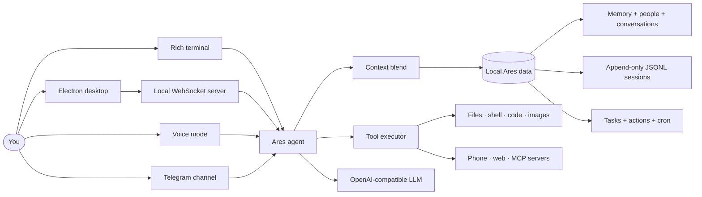

<div align="center">

# ⚡ Ares

### A local-first personal AI assistant for your terminal, desktop, voice, phone, and remote chat

[](pyproject.toml)
[](electron-app)
[](docs/mcp.md)
[](LICENSE)

**Remember what matters. Search every saved session. Take action with tools. Keep control local.**

[Quick start](#-quick-start) · [What it does](#-capability-map) · [Memory](#-memory-that-can-explain-itself) · [Skills](#-built-in-skills) · [MCP](#-mcp-integrations) · [Desktop](#-desktop-voice-phone-and-telegram)

</div>

---

## ✨ What Ares is

Ares is a terminal-first AI assistant that can also run through an Electron desktop app, WebSocket server, voice interface, Android phone bridge, and allowlisted Telegram channel. It combines an OpenAI-compatible model client with a local SQLite data layer, an append-only session archive, reusable skills, and a broad local tool surface.

<table>
  <tr>
    <td width="33%" valign="top"><h3>🧠 Recall</h3>Durable facts, structured people, SQLite conversations, and JSONL session history are searchable together.</td>
    <td width="33%" valign="top"><h3>🛠️ Act</h3>Use 83 local tools for files, code, web research, images, recurring jobs, tasks, phone controls, and more.</td>
    <td width="33%" valign="top"><h3>🧩 Extend</h3>Load local <code>SKILL.md</code> playbooks and connect MCP servers for browser, GitHub, fetch, Windows, and custom capabilities.</td>
  </tr>
</table>

## 🖼️ Ares in action

<table>
  <tr>
    <td width="50%"></td>
    <td width="50%"></td>
  </tr>
</table>

## 🚀 Quick start

### Terminal

```bash
git clone https://github.com/akyourowngames/friday.git
cd friday
pip install -e ".[dev]"
python -m ares
```

### Desktop app

```bash
cd electron-app
npm install
npm run dev
```

### Voice mode

```bash
pip install -e ".[voice]"
python -m ares --voice
```

### Local server

```bash
python -m ares --server --port 8766
```

> [!TIP]
> Start in the terminal first. Use `/setup`, `/model`, `/context`, and `/help` to inspect the active configuration and available controls.

---

## 🧭 How it fits together



## 🧠 Memory that can explain itself

The current recall system is deliberately broader than a single “memory facts” table. A question can search all local evidence sources at once:

| Source | Stored in | Example provenance |
|---|---|---|
| Durable facts | SQLite memory store with FTS/vector retrieval | `fact:42` |
| Saved people | Structured local people records | `person:7` |
| Conversation history | SQLite conversation messages | `conversation:12:message:88` |
| Session archive | `~/.ares/data/sessions/*.jsonl` | `session:sess-a1b2:line:18` |
| Actions | Durable provenance ledger | `action:31` |

`search_memory` reads session JSONL files directly on every lookup rather than depending on a stale side index. It also searches a small neighboring-turn window. That means a question such as “What was Rohit’s Instagram ID?” can recover a name in one historical turn and the ID in the next, then return the exact local source ID that produced the answer.

```text
Session line 17  User:      Rohit Verma is my cousin.
Session line 18  Assistant: His Instagram ID is @rohit_dev_42.

search_memory("Rohit Instagram")
  → session:sess-a1b2:line:18
  → @rohit_dev_42
```

> [!NOTE]
> Local history is evidence, not live external state. Ares preserves what was saved and identifies where it came from; it does not invent a detail that was never written to disk.

### Continuity upgrades

- **Full local recall:** facts, people, conversations, sessions, and actions in one tool result.
- **Session resilience:** malformed historical JSONL lines are skipped without discarding the rest of a session.
- **Context continuity:** “continue,” “that session,” and person references can pull relevant archived turns into context.
- **Structured people:** names, aliases, relationship notes, contact fields, and important dates are stored and retrieved as one local record.
- **Durable workflows:** task plans, leases, retries, verification steps, and a confirmation-aware runner survive process restarts.
- **Action provenance:** file, communication, export, and workflow outcomes can be located later without storing arbitrary command bodies.

---

## 🛠️ Capability map

<table>
  <tr>
    <th align="left">Area</th>
    <th align="left">What Ares can do</th>
  </tr>
  <tr>
    <td>🧠 Memory & people</td>
    <td>Store, search, update, delete, export, and import durable facts; manage complete local person records; search session and conversation history with provenance IDs.</td>
  </tr>
  <tr>
    <td>📁 Files & code</td>
    <td>Read, search, write, edit, diff, backup, undo, inspect, copy, move, hash, compare, batch-edit, and run persistent Python or shell sessions.</td>
  </tr>
  <tr>
    <td>🌐 Research</td>
    <td>Search the web, fetch pages and PDFs, label source quality, summarize findings, and use connected MCP browser tools when available.</td>
  </tr>
  <tr>
    <td>🖼️ Images</td>
    <td>Generate, inspect, resize, convert, crop, and track image assets with local metadata and transformation history.</td>
  </tr>
  <tr>
    <td>⏱️ Automation</td>
    <td>Create recurring cron jobs, inspect logs, create durable multi-step tasks, resume safe work, and request confirmation for consequential workflow steps.</td>
  </tr>
  <tr>
    <td>📱 Phone bridge</td>
    <td>Check Android bridge health, read notifications, search contacts, send SMS, place confirmed calls, and launch apps or URLs through KDE Connect and ADB.</td>
  </tr>
  <tr>
    <td>🖥️ Desktop control</td>
    <td>Use Windows MCP for snapshots, screenshots, application/window control, mouse, keyboard, clipboard, and notifications.</td>
  </tr>
  <tr>
    <td>🔌 Extensibility</td>
    <td>Discover local and community skills, search MCP registries, review additions, and reconnect integrations from the CLI or Telegram.</td>
  </tr>
</table>

### Local tool groups

| Group | Representative tools |
|---|---|
| Memory & continuity | `store_memory`, `search_memory`, `remember_person`, `search_person`, `search_actions`, `export_data` |
| File operations | `read_file`, `search_files`, `write_file`, `edit_file`, `batch_edit`, `preview_diff`, `undo_last_edit`, `find_duplicates` |
| Runtime | `run_code`, `run_command`, `terminal_exec` |
| Research & media | `web_search`, `fetch_url`, `generate_image`, `resize_image`, `convert_image`, `crop_image` |
| Scheduling & workflows | `create_cron_job`, `run_cron_job_now`, `create_task`, `get_task_status`, `run_task` |
| Phone & device | `phone_status`, `phone_get_notifications`, `phone_search_contact`, `phone_send_sms`, `phone_call_number` |

See the complete model-facing inventory in [`ares/tools/definitions.py`](ares/tools/definitions.py).

---

## 🧩 Built-in skills

Skills are local `SKILL.md` playbooks. Ares discovers relevant instructions, loads them silently when appropriate, and keeps them reusable across surfaces.

| Category | Skills |
|---|---|
| Ares operations | `export-backup`, `memory-consolidator`, `weekly-review` |
| Automation | `browser-content-review`, `browser-form-workflow`, `browser-use`, `computer-use` |
| Coding | `code-review`, `codebase-summary`, `project-init` |
| Communication | `conversation-conduct` |
| Productivity | `daily-planner`, `daily-standup` |
| Research | `research-deep-dive`, `web-research` |
| Utilities | `backup-snapshot`, `image-batch-processor`, `system-info` |

Skill discovery order:

```text
~/.ares/skills  →  .ares/skills  →  .agents/skills  →  ares/skills
```

Useful commands:

```text
/skills
/skills search code review
/skills info memory-consolidator
/skills create release-checklist
/skills load browser-use
```

---

## 🔌 MCP integrations

Ares exposes connected MCP tools to the agent as `mcp__server__tool`. The bundled configuration includes these local integration templates:

| MCP server | What it adds |
|---|---|
| Playwright | Browser navigation, inspection, forms, screenshots, and visible web-app control. |
| GitHub | Repository and GitHub workflow operations when configured with a token. |
| Fetch | Content retrieval for web pages and documents. |
| Windows MCP | Native Windows snapshots, app/window controls, mouse/keyboard, clipboard, and notifications. |

Manage connections without editing code:

```text
/mcp status
/mcp tools playwright
/mcp health
/mcp reconnect windows
/mcp search browser automation
/mcp add SERVER
```

See [MCP configuration and diagnostics](docs/mcp.md) for `stdio`, SSE, and Streamable HTTP server examples, browser modes, and OAuth token storage.

---

## 💬 Desktop, voice, phone, and Telegram

| Surface | Use it for | Start it with |
|---|---|---|
| Rich CLI | Fast local chat, slash commands, tools, and logs | `python -m ares` |
| Electron + React | Persistent sessions, settings, tool cards, and terminal surface | `cd electron-app && npm run dev` |
| WebSocket server | Serving the desktop client or local integrations | `python -m ares --server` |
| Voice | Streaming speech, interruption/barge-in, local Whisper or Sarvam/Edge options | `python -m ares --voice` |
| Telegram | Allowlisted remote chat, files, photos, voice notes, skills, and MCP management | `python -m ares --telegram` |

### Telegram setup

```powershell
# Create a BotFather bot first, then configure its token locally.
python -m ares --telegram-setup

# After your bot replies with its chat ID, authorize that exact chat on the PC.
python -m ares --telegram-authorize 123456789
```

Telegram uses long polling: no public IP, webhook, or port forwarding is required. Authorized chats can use `/new`, `/status`, `/skills`, `/mcp`, and `/file`; unknown chats never receive tool access.

---

## ⌨️ Everyday commands

| Command | Purpose |
|---|---|
| `/help` | Show available controls. |
| `/memory search QUERY` | Search durable facts and recall sources. |
| `/context` | Inspect active local context. |
| `/model` | List or change the configured model. |
| `/skills` | Discover, inspect, create, install, or manage skills. |
| `/mcp status` | Inspect MCP readiness and safe diagnostics. |
| `/browser status` | Inspect the effective Playwright browser connection mode. |
| `/phone status` | Check KDE Connect/ADB health. |
| `/export [PATH]` | Export local Ares data. |
| `/import PATH [--config]` | Import a previous local export. |
| `/soul show` · `/profile show` | Inspect assistant personality and user-profile context. |

---

## 🗂️ Local data layout

```text
~/.ares/
├── config.json                 # Model, bridges, MCP, and surface configuration
├── data/
│   ├── ares.db                 # Facts, embeddings, people, conversations, actions, cron
│   ├── sessions/*.jsonl        # Append-only session archive with line provenance
│   ├── soul.md                 # Assistant personality
│   ├── profile.md              # User profile
│   ├── mcp_tokens/             # OAuth tokens for MCP servers
│   └── channels/telegram/inbox # Files received for related Telegram turns
└── skills/                     # User-installed local skills
```

## 🧪 Development and verification

```bash
# Python behavior
python -m pytest -q

# Desktop production bundle
cd electron-app
npm run build
```

| Change | Verify with |
|---|---|
| Memory, sessions, people, or tools | Focused tests plus `python -m pytest -q` |
| Skill behavior | `python -m pytest tests/test_skills.py tests/test_prompts.py -q` |
| CLI rendering | Relevant renderer tests |
| Desktop UI | `cd electron-app && npm run build` |
| Documentation | Validate links, commands, and code examples |

## 🔐 Local-first boundaries

- Ares stores its local state under `~/.ares` by default.
- Web search sends queries to the selected provider; connected MCP servers run according to your local configuration.
- Phone controls operate through your paired Android device.
- Real-world and destructive actions remain explicit in their relevant tool workflows.
- Do not commit API keys, OAuth tokens, or secrets. Exported configuration redacts recognized secret fields.

## 📚 Further reading

- [MCP configuration and management](docs/mcp.md)
- [Marketplace guide](docs/marketplace.md)
- [Contributing guide](CONTRIBUTING.md)
- [Code of conduct](CODE_OF_CONDUCT.md)
- [Changelog](CHANGELOG.md)

## License

[MIT](LICENSE)
