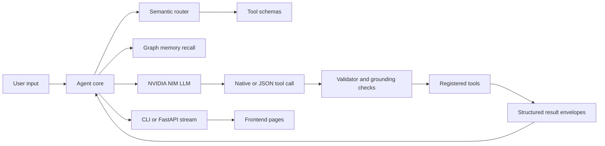

# KING: Local AI Assistant Runtime with Graph Memory and Tool Calling

KING is an open-source, local-first AI assistant runtime for developers who
want more than a chat box: semantic tool routing, graph-backed memory,
structured tool results, frontend control surfaces, and a verification pipeline
that proves behavior before the assistant claims it works.

It is built around a simple idea: an assistant should remember useful context,
use real tools when it has them, expose what it can do through inspectable
contracts, and avoid pretending that an action happened when no tool result
proved it.

## SEO Keywords

local AI assistant, open source Jarvis assistant, AI tool calling framework,
graph memory AI, semantic tool routing, local agent runtime, markdown driven
AI tools, personal AI assistant, NVIDIA NIM assistant, FastAPI AI assistant,
Next.js AI dashboard, Python AI agent, retrieval augmented memory, verified AI
tools, local automation assistant, open source AI agent

## Why Developers Star It

- **Graph memory by default**: durable facts become relation nodes and edges,
  with text projections kept for embeddings, display, and rollback.
- **Semantic tool routing**: tools are selected by embeddings and registry
  schemas, not fragile phrase tables.
- **Markdown-governed behavior**: tool policy, routing policy, memory rules,
  browser targets, system controls, and verification checks live in readable
  markdown files.
- **Structured tool results**: tools return typed success/error envelopes,
  provider status, trace metadata, and legacy text where older flows need it.
- **No fake success claims**: local actions, provider calls, and tool chains are
  grounded in returned fields instead of canned assistant replies.
- **Frontend included**: chat, memory graph, navigator, and tool-driven pages
  are available from the local web UI.
- **Verification is a feature**: a markdown-owned pipeline runs tests,
  compile checks, frontend type checks, and manifest audits.

## Open Source and Contributing

Friday/KING is open source and built for contributors. Pull requests, issues,
new tools, provider adapters, memory improvements, frontend surfaces, tests,
docs, and verification upgrades are welcome.

Good contribution paths:

- add a new tool with schema, typed errors, manifest evidence, and tests
- improve graph memory ranking, relation rules, or recall presentation
- add provider fallback logic without fake success claims
- polish the frontend pages for chat, memory, navigator, or folder watcher
- expand the verification pipeline with checks that produce useful evidence

Please keep changes grounded: no keyword routing shortcuts, no canned success
responses, no hidden verification claims, and no secrets in commits.

## Architecture



## Core Systems

| System | What it does | Key files |
| --- | --- | --- |
| Agent runtime | Conversation loop, tool-call parsing, grounding, summaries | `agent/core.py`, `agent/router.py`, `agent/validator.py` |
| Tool registry | Discovers callable tools and JSON schemas | `tools/registry.py`, `tools/TOOL_MANIFEST.md` |
| Memory | Graph storage, vector recall, relation rules, profile context | `memory/brain.py`, `memory/MEMORY_UNIFIED_MODEL.md`, `memory/MEMORY_GRAPH_RELATIONS.md` |
| Frontend | Local web assistant, memory graph, navigator surface | `api_server.py`, `public/frontend/`, `src/app/` |
| Folder watcher | Local file intelligence service with API, index, dashboard, deploy templates | `folder_watcher/`, `deploy/folder_watcher/` |
| Verification | Markdown-defined ship checks and evidence | `tools/TOOL_VERIFICATION_PIPELINE.md`, `tests/` |

## Tool Surface

KING ships with tools for:

- browser extraction and saved login sessions
- file read/write/list
- Hacker News and Reddit retrieval
- image generation and gallery management
- keyboard shortcuts and system controls
- memory recall, remember, forget, and assessment
- navigator routes and place details
- notes, terminal commands, datetime, web search, YouTube, and manifest audits
- folder watcher indexing, search, status, webhooks, and deployment

The registry remains the callable source of truth. Markdown files describe and
govern behavior; they are not keyword routing tables.

## Quickstart

```powershell
python -m venv .venv
.\.venv\Scripts\Activate.ps1
pip install -r requirements.txt
npm install
Copy-Item .env.example .env
python main.py
```

Run the API and frontend:

```powershell
npm run api
npm run dev
```

Then open the local frontend served by Next.js or the static pages under
`public/frontend/`.

## Configuration

Copy `.env.example` to `.env`, then set provider keys and tuning knobs as
needed. The most important configuration areas are:

- `NVIDIA_API_KEY` and model settings for the LLM backend
- `KING_MEMORY_*` for graph memory, vector recall, and ranking
- `KING_TOOL_*` for routing, retries, grounding, and result bounds
- `KING_BROWSER_*`, `KING_SYSTEM_*`, and `KING_NAVIGATOR_*` for tool providers
- `KING_VERIFICATION_PIPELINE_*` for bounded ship checks

## Verification

Use the repo-owned verification path before claiming a change is shipped:

```powershell
python -m pytest -q
npm run typecheck
python -c "import tools; from tools.manifest_audit import tool_manifest_audit; print(tool_manifest_audit('.', 300, True))"
```

For the full markdown-defined toolchain check, use the verification tool or run
the commands listed in `tools/TOOL_VERIFICATION_PIPELINE.md`.

## Reusable Code Gists

These public GitHub Gists extract the most useful code patterns from this repo:

- [JSON tool-call leak guard](https://gist.github.com/akyourowngames/a4ae05d4a11a0b36cf2be9f227f3d96b)
- [Semantic tool router](https://gist.github.com/akyourowngames/f6492d54f7f1f7302d5f1ed387f89a5a)
- [Structured tool result envelopes](https://gist.github.com/akyourowngames/5e1f59861ad965e0fe1a585ac9cbb022)
- [Graph memory unified ranker](https://gist.github.com/akyourowngames/64563ec381c7a435b13a79facd742a4e)

## Repository Map

```text
agent/                 core assistant loop, routing, validation, LLM client
memory/                graph memory, vector store, relation and recall docs
tools/                 registered tools plus markdown control surfaces
folder_watcher/        local file intelligence service
public/frontend/       static assistant, memory, navigator, and viewer pages
src/app/               Next.js app shell
tests/                 grounding, memory, tool, frontend-adjacent checks
deploy/folder_watcher/ service, Docker, launchd, nginx templates
```

## License

MIT. Use it, fork it, remix it, and send improvements back.

## Project Status

KING is an active open-source local assistant research/runtime repo. It is
strongest as a developer playground for agent memory, tool grounding, local
automation, and frontend-visible tool workflows.
