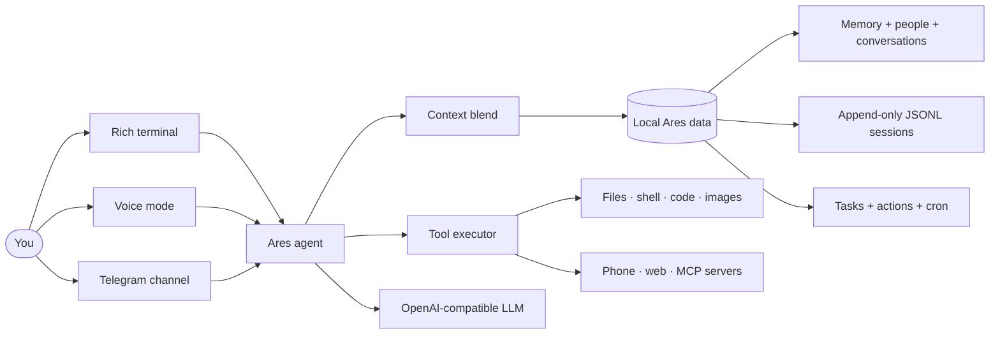

<div align="center">

# ⚡ Ares

### A personal AI assistant for your terminal, voice, phone, and remote chat — with local-first data control

[](pyproject.toml)
[](docs/mcp.md)
[](LICENSE)

**Remember what matters. Search every saved session. Take action with tools. Keep control local.**

[Quick start](#-quick-start) · [Personality](#-personality-and-profile) · [Vision](#-local-vision-v1) · [Watchers](#-proactive-watchers) · [What it does](#-capability-map) · [Memory](#-memory-that-can-explain-itself) · [Skills](#-built-in-skills) · [MCP](#-mcp-integrations) · [Voice, phone, and Telegram](#-voice-phone-and-telegram)

</div>

---

## ✨ What Ares is

Ares is a terminal-first AI assistant with a separate Next.js power workspace, an optional local WebSocket API, voice interface, Android phone bridge, and allowlisted Telegram channel. It combines an OpenAI-compatible model client with a local SQLite data layer, an append-only session archive, reusable skills, and a broad local and remote tool surface.

Ares is **not** an offline or local-only assistant: it reaches external providers (OpenCode Zen, NVIDIA NIM, GitHub Copilot), connects to remote MCP servers, and serves allowlisted Telegram, phone, and web surfaces. "Local-first" here refers to *data control* — your facts, people, conversations, sessions, and configuration live under `~/.ares` on your machine — not to a limitation on where Ares can act.

<table>
  <tr>
    <td width="33%" valign="top"><h3>🧠 Recall</h3>Durable facts, structured people, SQLite conversations, and JSONL session history are searchable together.</td>
    <td width="33%" valign="top"><h3>🛠️ Act</h3>Use 156 local tools for goals, watchers, native specialists, files, configured project checks, code, web research, images, local vision, recurring jobs, tasks, phone controls, provider telephony, and more.</td>
    <td width="33%" valign="top"><h3>🧩 Extend</h3>Load local <code>SKILL.md</code> playbooks and connect MCP servers for browser, GitHub, fetch, Windows, and custom capabilities.</td>
  </tr>
</table>

### Latest upgrades

- **Keyboard-driven terminal UI:** type slash for command suggestions, use ↑/↓ to select a completion, and open **/menu** for arrow-key screens for models, providers, tools, profile, personality, and saved chats.
- **Reliable conversation restore:** **/resume** excludes blank startup rows and restores the selected chat into the active model context without replaying its transcript in the terminal.
- **Provider-aware model switching:** OpenCode Zen, NVIDIA NIM, and GitHub Copilot models select their matching endpoint and credentials automatically, avoiding cross-provider 404s after a model change.
- **Local Vision V1:** inspect user-supplied images or, with explicit per-source consent, observe local camera and screen sources. Vision can detect objects, read text, compare snapshots, verify visual conditions, and run bounded watches with conservative local retention.
- **Faster foreground responses:** ordinary chat streams through a short tool-call decision buffer; durable reflection, memory statistics, and reusable context work move off the first-token path when safe.
- **More capable existing tools:** legacy calls remain compatible while opt-in structured responses add previews, plans, provenance, verification, undo metadata, safer batch operations, and protected exports. See the [existing-tool upgrades guide](docs/existing-tool-upgrades-guide.md).
- **Native multi-agent supervisor:** Ares can delegate bounded research, code analysis, implementation, review, and synthesis to isolated specialists; independent work runs concurrently, dependencies run in waves, and the root Ares agent still owns the final answer.
- **Goal-aware monitoring:** link one watcher to multiple goals, review routed signals in both watcher consoles, and keep progress changes explicit instead of automatic.
- **Research delivery:** search and rank web sources, fetch online pages/PDFs/reports, extract readable content, save sourced artifacts, and deliver supported files through Telegram.
- **Power workspace:** isolated background chats, smooth token streaming, cached history with skeleton loading, structured tool traces, and built-in previews for Markdown, PDFs, images, and generated files.
- **One runtime:** `python -m ares --all` starts chat, Telegram, integrations, watchers, the workspace, and the advanced console around the same Ares agent.
- **True parallel specialists:** the multi-agent resource coordinator now uses per-resource semaphores (e.g. `external: 12`, `communication: 8`, `delegation: 8`) instead of one lock per resource, so independent specialists run concurrently in a single wave. The unresponsive-tool quarantine is now per-resource, so one hung call no longer freezes unrelated workers. SQLite writes and the REPL stay serialized for safety.
- **Telegram model & provider switching:** `/model [id|list]` and `/provider [name|list]` change the active model/provider from Telegram and persist to the shared config.
- **Telegram + CLI MCP removal:** `/mcp remove <name>` (Telegram, with the same confirm-code safety as add) and `/mcp remove SERVER` (CLI) disconnect and delete a configured MCP server and reload tools.
- **Shared database connection:** `ConversationStore` reuses the agent's memory connection, eliminating a startup `database is locked` race when multiple stores opened separate connections to `ares.db`.
- **Dev hot-reload:** `python -m ares.dev` runs `python -m ares --all` and auto-restarts the process when any `ares/` source or `pyproject.toml` changes — zero extra dependencies, clean terminate-and-respawn.

## 🚀 Quick start

### Terminal

```bash
git clone https://github.com/akyourowngames/friday.git
cd friday
pip install -e ".[dev]"
python -m ares
```

### Keyboard-driven terminal

In an interactive terminal, type slash to open command suggestions. Use **↑/↓** to choose a suggestion and **Enter** to apply it. **/menu** opens the command center; the bare forms of **/model**, **/provider**, **/tools**, **/profile**, **/soul**, and **/resume** open arrow-key screens instead of only printing tables.

**/resume** lists only chats containing saved user or assistant messages, never the empty row created for a new launch. Selecting a chat restores its bounded history into the next model request without reprinting that chat in the terminal. Use **/resume latest** or **/resume ID** when scripting.

Model selection is provider-aware: choosing an OpenCode Zen or NVIDIA NIM model switches to its matching endpoint before the request is made. **/provider opencode**, **/provider nim** (or the **nvidia** alias), and **/provider copilot** also select a compatible default model. Provider-specific keys remain isolated in the local configuration.

### Voice mode

```bash
pip install -e ".[voice]"
python -m ares --voice
```

### Unified always-on runtime

```bash
python -m ares --all
# Desktop API: ws://127.0.0.1:8765
# Power workspace: http://127.0.0.1:8766
# Advanced watcher console: http://127.0.0.1:8080
```

`--all` owns one agent, one integration manager, one watcher scheduler, the Next.js power workspace, the advanced watcher console, the desktop API, and Telegram when it is enabled. `--server` remains a compatibility alias; watchers are tools used by Ares and are not launched as an independent product process.

### Local Vision V1

Ares can inspect a user-provided image directly and can observe a local camera or screen only after explicit per-source consent. It supports local object detection, OCR, scene events, visual comparisons, evidence-based verification, bounded watches, and opt-in visual memory.

Install the optional local CV/OCR providers when you need camera or screen capture, object detection, or OCR:

```bash
pip install -e ".[vision]"
```

Camera and screen capture are disabled by default. Ares requires an explicit observation grant to activate a source, shows active-source state, redacts sensitive text from stored metadata, and does not retain frames unless you separately configure retention. Visual events are evidence—not automatic goal completion or external action.

Example prompts:

```text
Describe this image and read the visible text.
With my permission, watch this screen for a successful build message.
Compare this new photo with the previous snapshot and tell me what changed.
Verify whether the package label is visible; say uncertain if the evidence is weak.
```

### Next.js power workspace

The power workspace is intentionally separate from the public marketing website. It provides one operational surface for streaming Ares chat, reusable file uploads, skills, MCP connections, watcher fleet management, personalization, browser configuration, Telegram setup, and advanced runtime settings. Chat, watcher actions, MCP operations, and settings all use the same running Ares agent and WebSocket protocol.

The production build is bundled with the Python package and served at `http://127.0.0.1:8766` by `python -m ares --all`. For frontend development:

```bash
cd ares-workspace
npm install
npm run dev
```

`npm run build` creates the static Next.js export and synchronizes it into `ares/workspace/static` for the Python runtime.

### Native multi-agent mode

Multi-agent mode is enabled conservatively by default. Native agents are independent specialist model loops with real child run/session IDs and a durable execution manifest. Parallel tool calls remain one agent, and durable `create_task`/`run_task` workflows remain zero agents. Ares never presents either mechanism as a specialist team.

Routing is deterministic and based only on the current turn. An explicit request for agents must launch a bounded native plan or say why zero agents ran; it cannot silently fall back to a workflow. Ares can also delegate useful independent workstreams automatically, while greetings, thanks, one lookup, small edits, and agent meta-questions stay single-agent. “How many agents did you use?” reads the latest manifest for that session instead of opening a browser or trusting earlier prose.

Every child has an isolated history/session, unique run ID, bounded assignment/dependency context, role-specific tool allowlist, independent capability grants, and its own model/iteration/timeout budget. Personal/global context and automatic skills are excluded by default. Consequential child actions require an exact root-issued, expiring, single-use grant bound to the root, child, request, tool, and argument hash. Overlapping writes and stateful browser/shell/Python operations serialize; multiple builders use detached worktrees when safe, return reviewable patch artifacts, and only root-side sequential application follows an explicit reviewer approval. Dirty or unsupported repositories share one live-tree mutation lock.

The chat workspace renders the session-owned manifest with roles, dependency waves, elapsed time, current tool, sources, results, artifacts, partial failures, synthesis, and cancellation. WebSocket and Telegram events, artifacts, run lookup, and cancellation are filtered to the selected conversation/chat.

Example prompts:

- “Research three approaches in parallel and compare them.”
- “Inspect the backend and frontend separately, then create an implementation plan.”
- “Have a builder implement this feature and a reviewer verify the changes.”
- “Analyze this bug using a code analyst, documentation researcher, and verifier.”

Terminal controls:

```text
/agents status
/agents active
/agents roles
/agents runs [LIMIT]
/agents show RUN_ID
/agents cancel RUN_ID
/agents resume RUN_ID
/agents run REQUEST
/agents doctor
/agents smoke-test
/agents on
/agents off
```

`/agents doctor` is local and model-free. `/agents run` and `/agents smoke-test` launch real configured specialists and can use provider quota. For the deterministic offline acceptance suite (fake executors, no model/browser/network/API), run:

```bash
python -m ares.multi_agent_smoke
python -m pytest -q -p no:cacheprovider tests/test_multi_agent_smoke.py
```

Configuration, lifecycle, failure behavior, safety, truthful counting, and operations are documented in [Native multi-agent mode](docs/multi-agent.md). Maintainers should also read [Multi-agent architecture](docs/multi-agent-architecture.md).

> [!TIP]
> Start in the terminal first. Use `/setup`, `/model`, `/context`, and `/help` to inspect the active configuration and available controls.

---

## 📡 Proactive watchers

Ares can run a durable monitoring fleet over websites, REST/JSON APIs, numeric thresholds, permitted Instagram Graph API endpoints, authenticated Playwright pages, and the results of existing Ares or connected MCP tools. Watchers are part of the normal agent tool plane: you can ask Ares to create, inspect, run, pause, resume, or query them in natural language.

The control plane is local by default and includes:

- A real-time overview, fleet health, incident queue, latency telemetry, delivery-channel health, and persistent settings.
- SHA-256, text diff, and numeric threshold detection with regex noise suppression and first-run baselines.
- Concurrent scheduling, cross-process leases, bounded fetch timeouts, exponential retry backoff, auto-pause after repeated failures, and snapshot retention.
- Telegram, desktop, email, and webhook delivery with per-channel attempt logs and background retries.
- Optional Ares analysis for suggestions and explicit, auditable webhook-only automatic actions.
- SSRF protection, private-network opt-in, cross-origin redirect controls, secret redaction, and optional `ARES_WATCHER_API_TOKEN` dashboard authentication.
- Bounded read-only tool workflows that reuse phone, files, web, browser, and MCP integrations. Consequential steps such as clicks, typing, sending, deletion, or shell execution require global and per-watcher opt-in.

Examples you can ask Ares directly:

```text
Monitor my Instagram DMs every 5 minutes using my authenticated Playwright session.
Watch my Android notifications and alert me when a new banking notification appears.
Create a watcher over the GitHub MCP tool result for open production incidents.
Show failing watchers and acknowledge the incident from the deployment-status watcher.
Run the Instagram inbox watcher now and tell me what changed.
```

The agent exposes `create_watcher`, `list_watchers`, `get_watcher`, `update_watcher`, `run_watcher_now`, fleet/event query tools, pause/resume, acknowledgement, capability discovery, and confirmed deletion. Use `get_watcher_capabilities` when Ares needs to inspect the currently connected MCP tools before building a workflow.

### Goal-aware watcher signals

Watchers can be linked to one or many durable goals. Pass `goal_id` to `create_watcher` for a one-step setup, or use `link_goal_watcher` later. Every detected change is fanned out idempotently using the watcher event UUID and stored in `goal_watcher_signals` with severity, old/new values, source provenance, snooze state, resolution, and surface count.

A signal never changes goal progress or status. It appears in goal context for at most three turns during its first 48 hours, then remains available through `get_goal_signals` or `/goals signals` without nagging. The user can snooze or dismiss it, or explicitly confirm an `update_goal`/`complete_goal` call with `resolves_signal_id`; that mutation and signal acknowledgement share one SQLite transaction. Once every goal-specific copy is resolved, Ares reconciles the originating watcher incident too.

See [`docs/goal-watcher-integration.md`](docs/goal-watcher-integration.md) for the runtime sequence, persistence contract, anti-nag rules, and operator examples.

```text
Create a goal to buy a laptop under $1,000, then watch this product page and link it.
Show pending watcher signals for my laptop goal.
Not now—snooze signal 12 for two days.
Yes, the price is low enough; complete the goal and resolve signal 12.
```

For authenticated DMs, configure `/browser extension` or `/browser system`, sign in normally, and let the browser watcher navigate to or snapshot the inbox. Ares stores the captured signal—not your password—and never automates credential entry. The dashboard’s **Browser / DMs (Playwright)** source includes an Instagram inbox starter recipe; **Ares tool workflow** provides a visible JSON workflow editor for any read-only tool chain.

Terminal controls use short IDs or exact names:

```text
/monitor add "Production status" https://status.example.com --interval 5m --type website
/monitor add "Laptop price" https://shop.example.com/laptop --interval 15m --goal 12
/monitor list
/monitor status ID
/monitor pause ID
/monitor resume ID
/monitor events ID
/monitor test ID
/monitor remove ID
```

Telegram exposes `/monitors`, `/monitor ...`, and `/alerts`. The scheduler starts automatically in Ares when `watcher.enabled` is true. Use `python -m ares --all` for the unified always-on runtime; database leases remain as a defensive guarantee against duplicate checks during upgrades or accidental overlapping processes.

Watcher configuration is stored under the shared `watcher` object in `~/.ares/config.json`. Notification passwords and bot tokens can remain outside the file through `ARES_WATCHER_SMTP_PASSWORD` and `ARES_TELEGRAM_BOT_TOKEN`.

```json
{
  "watcher": {
    "enabled": true,
    "tool_monitors_enabled": true,
    "allow_mutating_tool_steps": false,
    "max_tool_steps": 8,
    "dashboard": { "enabled": true, "host": "127.0.0.1", "port": 8080 }
  }
}
```

Keep `allow_mutating_tool_steps` off for normal monitoring. Enabling a consequential workflow also requires `"allow_mutating_tools": true` on that specific watcher, and should only be used for an explicitly reviewed automation. Respect the monitored service’s permissions and terms.

---

## 🧭 How it fits together



## 🧠 Memory that can explain itself

The current recall system is deliberately broader than a single “memory facts” table. A question can search all local evidence sources at once:

| Source | Stored in | Example provenance |
|---|---|---|
| Durable facts | SQLite memory store with FTS/vector retrieval | `fact:42` |
| Saved people | Structured local people records | `person:7` |
| Conversation history | SQLite conversation messages | `conversation:12:message:88` |
| Session archive | `~/.ares/data/sessions/*.jsonl` | `session:sess-a1b2:line:18` |
| Actions | Durable provenance ledger | `action:31` |

`search_memory` reads session JSONL files directly on every lookup rather than depending on a stale side index. It also searches a small neighboring-turn window. That means a question such as “What was Rohit’s Instagram ID?” can recover a name in one historical turn and the ID in the next, then return the exact local source ID that produced the answer.

Memory V3 adds one automatic post-turn reflection path, provenance-preserving
observations, immediate durable factual promotion, outcome-aware Hermes reviews,
reviewed procedural learning, pre-compaction checkpoints, normalized hybrid ranking,
time decay, and MMR. Foreground recall performs zero extra model calls, embedding
startup warms after reply delivery, and an incoming message preempts/requeues a slow
background review. Ordinary messages also send only intent-relevant tool schemas
(`hey` sends none), instead of the full tool catalog, and tool-free conversation can
use a configurable fast model while substantive work keeps the selected primary model.
New procedures require explicit approval before prompt injection;
revisions and archive/restore keep learning observable and reversible.
See [the Memory V3 architecture and operating guide](docs/ares-memory-v3.md).

```text
Session line 17  User:      Rohit Verma is my cousin.
Session line 18  Assistant: His Instagram ID is @rohit_dev_42.

search_memory("Rohit Instagram")
  → session:sess-a1b2:line:18
  → @rohit_dev_42
```

> [!NOTE]
> Local history is evidence, not live external state. Ares preserves what was saved and identifies where it came from; it does not invent a detail that was never written to disk.

### Continuity upgrades

- **Full local recall:** facts, people, conversations, sessions, and actions in one tool result.
- **Reviewed self-improvement:** real tool outcomes produce Hermes proposals; only approved learnings become active local procedures.
- **Compaction-safe capture:** each lossy compaction segment receives one durable, restart-safe reflection checkpoint.
- **Explainable ranking:** local query expansion, warm vector/keyword/metadata fusion, decay, MMR, warm-up state, fallbacks, and timings are inspectable.
- **Session resilience:** malformed historical JSONL lines are skipped without discarding the rest of a session.
- **Context continuity:** “continue,” “that session,” and person references can pull relevant archived turns into context.
- **Structured people:** names, aliases, relationship notes, contact fields, and important dates are stored and retrieved as one local record.
- **Evidence-backed goals:** multi-level outcomes, due dates, priorities, manual/derived progress, task/action/watcher links, proactive signal review, and an append-only check-in timeline live in the shared database.
- **Durable workflows:** task plans, leases, retries, verification steps, and a confirmation-aware runner survive process restarts.
- **Action provenance:** file, communication, export, and workflow outcomes can be located later without storing arbitrary command bodies.

---

## 🛠️ Capability map

<table>
  <tr>
    <th align="left">Area</th>
    <th align="left">What Ares can do</th>
  </tr>
  <tr>
    <td>🧠 Memory & people</td>
    <td>Store, search, update, delete, export, and import durable facts; manage complete local person records; search session and conversation history with provenance IDs.</td>
  </tr>
  <tr>
    <td>🎯 Goals</td>
    <td>Create, search, revise, pause, decompose, complete, or abandon durable goals; link Tasks and Actions as evidence; explicitly synchronize progress; inspect due, overdue, and timeline state.</td>
  </tr>
  <tr>
    <td>📁 Files & code</td>
    <td>Read, search, write, edit, diff, backup, undo, inspect, copy, move, hash, compare, batch-edit, and run persistent Python or shell sessions.</td>
  </tr>
  <tr>
    <td>🌐 Research</td>
    <td>Search the web, fetch pages and PDFs, label source quality, summarize findings, and use connected MCP browser tools when available.</td>
  </tr>
  <tr>
    <td>👁️ Vision</td>
    <td>Inspect user-provided images and, with explicit per-source consent, observe local camera or screen sources; run OCR, object/scene detection, comparisons, evidence-based verification, and bounded visual watches.</td>
  </tr>
  <tr>
    <td>🖼️ Images</td>
    <td>Generate, inspect, resize, convert, crop, and track image assets with local metadata and transformation history.</td>
  </tr>
  <tr>
    <td>⏱️ Automation</td>
    <td>Create recurring cron jobs, run proactive website/API/price watchers, inspect monitoring telemetry and incidents, create durable multi-step tasks, resume safe work, and request confirmation for consequential workflow steps.</td>
  </tr>
  <tr>
    <td>📱 Phone bridge</td>
    <td>Check Android bridge health, read notifications, search contacts, send SMS, place confirmed calls, and launch apps or URLs through KDE Connect and ADB.</td>
  </tr>
  <tr>
    <td>☎️ Provider telephony</td>
    <td>Use Twilio Voice with a LiveKit-compatible media gateway for outbound/inbound calls, interruption-aware Ares conversations, encrypted contacts, local transcripts, summaries, transfers, and call history.</td>
  </tr>
  <tr>
    <td>🖥️ Desktop control</td>
    <td>Use Windows MCP for snapshots, screenshots, application/window control, mouse, keyboard, clipboard, and notifications.</td>
  </tr>
  <tr>
    <td>🔌 Extensibility</td>
    <td>Discover local and community skills, search MCP registries, review additions, and reconnect integrations from the CLI or Telegram.</td>
  </tr>
</table>

### Local tool groups

| Group | Representative tools |
|---|---|
| Memory & continuity | `store_memory`, `search_memory`, `remember_person`, `search_person`, `search_actions`, `export_data` |
| Goals & evidence | `create_goal`, `list_goals`, `decompose_goal`, `link_goal_task`, `link_goal_action`, `link_goal_watcher`, `get_goal_signals`, `snooze_goal_signal`, `record_goal_progress`, `sync_goal_progress` |
| Proactive watchers | `create_watcher`, `run_watcher_now`, `list_watcher_events`, `acknowledge_watcher_event`, `get_watcher_overview` |
| Native specialists | `list_agents`, `delegate_task`, `delegate_tasks_parallel`, `get_agent_run`, `list_agent_runs`, `get_latest_agent_run`, `cancel_agent_run`, `resume_agent_run` |
| File operations | `read_file`, `search_files`, `write_file`, `edit_file`, `batch_edit`, `preview_diff`, `undo_last_edit`, `find_duplicates` |
| Runtime | `run_code`, `run_command`, `terminal_exec` |
| Research & media | `web_search`, `fetch_url`, `generate_image`, `resize_image`, `convert_image`, `crop_image` |
| Local Vision | `vision_observe`, `vision_watch`, `vision_compare`, `vision_verify`, `vision_remember`, `vision_start_source`, `vision_stop_source`, `vision_list_events` |
| Scheduling & workflows | `create_cron_job`, `run_cron_job_now`, `create_task`, `get_task_status`, `run_task` |
| Phone & device | `phone_status`, `phone_get_notifications`, `phone_search_contact`, `phone_send_sms`, `phone_call_number` |
| Provider telephony | `telephony_call`, `telephony_hangup`, `telephony_mute`, `telephony_list_calls`, `telephony_list_contacts`, `telephony_save_contact`, `telephony_transfer` |

See the complete model-facing inventory in [`ares/tools/definitions.py`](ares/tools/definitions.py).

---

## 🧩 Built-in skills

Skills are local `SKILL.md` playbooks. Ares discovers relevant instructions, loads them silently when appropriate, and keeps them reusable across surfaces.

| Category | Skills |
|---|---|
| Ares operations | `export-backup`, `memory-consolidator`, `weekly-review` |
| Automation | `browser-content-review`, `browser-form-workflow`, `browser-use`, `computer-use` |
| Coding | `code-review`, `codebase-summary`, `project-init` |
| Communication | `conversation-conduct` |
| Productivity | `daily-planner`, `daily-standup`, `goal-management`, `goal-check-in` |
| Research | `research-deep-dive`, `web-research` |
| Utilities | `backup-snapshot`, `image-batch-processor`, `system-info` |

Skill discovery order:

```text
~/.ares/skills  →  .ares/skills  →  .agents/skills  →  ares/skills
```

Useful commands:

```text
/skills
/skills search code review
/skills info memory-consolidator
/skills create release-checklist
/skills load browser-use
```

---

## 🔌 MCP integrations

Ares exposes connected MCP tools to the agent as `mcp__server__tool`. The bundled configuration includes these local integration templates:

| MCP server | What it adds |
|---|---|
| Playwright | Browser navigation, inspection, forms, screenshots, and visible web-app control. |
| GitHub | Repository and GitHub workflow operations when configured with a token. |
| Fetch | Content retrieval for web pages and documents. |
| Windows MCP | Native Windows snapshots, app/window controls, mouse/keyboard, clipboard, and notifications. |

Manage connections without editing code:

```text
/mcp status
/mcp tools playwright
/mcp health
/mcp reconnect windows
/mcp search browser automation
/mcp add SERVER
/mcp remove SERVER
```

See [MCP configuration and diagnostics](docs/mcp.md) for `stdio`, SSE, and Streamable HTTP server examples, browser modes, and OAuth token storage.

For the optional GitHub Copilot SDK provider and user-authorized OAuth setup, see [GitHub Copilot](docs/copilot.md).

---

## 💬 Voice, phone, and Telegram

| Surface | Use it for | Start it with |
|---|---|---|
| Rich CLI | Fast local chat, slash commands, tools, and logs | `python -m ares` |
| Unified runtime | Next.js power workspace, desktop API, MCP tools, Telegram, watcher scheduler, and advanced watcher console | `python -m ares --all` |
| WebSocket API compatibility alias | Same unified runtime | `python -m ares --server` |
| Voice | Streaming speech, interruption/barge-in, local Whisper or Sarvam/Edge options | `python -m ares --voice` |
| Twilio webhook | Signed Voice and status callbacks (behind public HTTPS) | `python -m ares --telephony-webhook` |
| Twilio media | Bidirectional Media Streams, local Whisper, Ares tools/memory, Edge TTS (behind public WSS) | `python -m ares --telephony-media-gateway` |
| LiveKit worker | Ares voice worker that accepts LiveKit agent jobs | `ares-livekit dev` |
| LiveKit room | Local browser room that mints a short-lived token and connects after a user click | `ares-livekit-room --room ares-voice-room` |
| Workspace voice | Embedded LiveKit voice conversation from the composer microphone | `python -m ares --all` + `ares-livekit dev` |
| Telegram | Allowlisted remote chat inside the unified runtime | `python -m ares --all` |

### Provider-backed phone calls

Install the optional runtime, then enable **Telephony** in desktop Settings. Ares provides both local processes: a signed Twilio callback server and a bidirectional Media Streams gateway. Publish their loopback ports through HTTPS/WSS (for example with a reverse proxy or tunnel), then save the public addresses in `telephony.public_base_url` and `telephony.media_stream_url`. A Twilio-owned E.164 caller number is also required.

```powershell
pip install -e ".[telephony]"

# Start these in separate terminals. They bind only to the local machine.
python -m ares --telephony-webhook --telephony-webhook-port 8080
python -m ares --telephony-media-gateway --telephony-media-port 8767
```

The media gateway converts Twilio's 8 kHz mu-law stream to local Whisper input, runs the normal Ares agent (including memory and tools), and returns Edge TTS audio to the call. It does not select an OpenAI realtime model. LiveKit rooms use the same local credentials, a separate voice worker, and a loopback-only browser launcher.

### LiveKit voice rooms

LiveKit rooms are created automatically when the first participant joins. Ares now separates the worker and browser-room concerns so joining is fast and does not require pasting a JWT.

When the unified runtime is open, the microphone in the Power Workspace starts the same conversation directly in Ares. It mints a fresh, short-lived token through a loopback-only workspace endpoint; no token or API credential is placed in a browser URL. Keep `ares-livekit dev` running, click the microphone, and allow microphone access when prompted.

```powershell
# Terminal 1: start the Ares LiveKit worker.
ares-livekit dev

# Terminal 2: start the loopback-only room launcher.
# It opens the browser and issues a 10-minute token locally after Connect is clicked.
ares-livekit-room --room ares-voice-room --identity krish
```

The launcher binds only to `127.0.0.1`/localhost, never puts the JWT in the URL, and sends `Cache-Control: no-store`. It reads `LIVEKIT_URL`, `LIVEKIT_API_KEY`, and `LIVEKIT_API_SECRET` from the environment or the local `telephony` config. Use `--no-open` when you want to open the local URL yourself.

For a separate client, integration, or debugging workflow, generate only a short-lived token:

```powershell
ares-livekit-token --room ares-voice-room --identity krish
ares-livekit-token --room ares-voice-room --identity krish --json
```

The room launcher is also available through `python -m ares --livekit-join --livekit-room ares-voice-room --livekit-identity krish`. Run the worker and launcher in separate terminals.

#### Sarvam voice for LiveKit

Set `SARVAM_API_KEY` in your local environment and keep `voice.tts_backend` as `auto` (or set it to `sarvam`). The LiveKit worker then uses Sarvam Bulbul v3 instead of Edge TTS; without the key, it safely falls back to Edge.

```powershell
$env:SARVAM_API_KEY = "your-sarvam-key"
# Optional Ares voice settings: speaker=shubh, model=bulbul:v3, language=en-IN, pace=0.9
ares-livekit dev
```

Bulbul v3 is suited to Indian English, Indic languages, and code-mixed speech. Configure the speaker, language, and pace under `voice.sarvam_speaker`, `voice.sarvam_language_code`, and `voice.sarvam_pace` in `~/.ares/config.json`.

Ares stores call sessions, transcripts, summaries, and encrypted telephony contacts locally in `~/.ares/data/ares.db`; the encryption key lives separately at `~/.ares/data/telephony.key`.

```text
/call Mom
/call +911234567890 --confirm
/telephony status
/contacts
/recent-calls
/hangup CALL_ID
```

Run `/telephony status` to see redacted readiness. It reports missing deployment fields without displaying credentials. No call is placed until you explicitly use `/call`.

### Telegram setup

```powershell
# Create a BotFather bot first, then configure its token locally.
python -m ares --telegram-setup

# After your bot replies with its chat ID, authorize that exact chat on the PC.
python -m ares --telegram-authorize 123456789
```

Telegram uses long polling: no public IP, webhook, or port forwarding is required. Authorized chats can use `/new`, `/status`, `/model`, `/provider`, `/skills`, `/mcp`, `/file`, `/agents`, and `/workers`; unknown chats never receive tool access. Ares registers the command menu with Telegram automatically. During delegated work, one throttled, chat-scoped status message shows every specialist's role, task, state, current tool, team totals, and final success/issue count instead of posting a new message for every event. Remote supervisor commands can inspect or cancel only runs owned by that Telegram session; enable/disable, forced runs, doctor, and provider-backed smoke tests stay local.

Useful remote supervisor commands:

```text
/agents status
/agents active
/agents roles
/agents runs 10
/agents show RUN_ID
/agents cancel RUN_ID
/agents resume RUN_ID
/workers
```

---

## ⌨️ Everyday commands

| Command | Purpose |
|---|---|
| `/help` | Show available controls. |
| `/menu` | Open the arrow-key command center in an interactive terminal. |
| `/memory search QUERY` | Search durable facts and recall sources. |
| `/memory learning [pending\|active\|approve ID\|reject ID]` · `/memory explain` | Review Hermes learning proposals or inspect the last low-latency retrieval decision. |
| `/latency` | Show the latest message model, tool-schema count, context time, provider TTFT, and total latency. |
| `/memory archive ID` · `/memory restore ID` | Reversibly remove or restore a durable fact. |
| `/goals [search|show|due|signals]` | Inspect active goals, hierarchy, progress evidence, deadlines, and pending watcher signals. |
| `/context` | Inspect active local context. |
| `/model [MODEL]` | Choose a model interactively or switch directly; Ares aligns the provider and endpoint. |
| `/provider [NAME]` | Choose an endpoint interactively or switch provider directly. |
| `/resume ID` or `/resume latest` | Restore a saved chat into the active context without replaying its transcript. |
| `/skills` | Discover, inspect, create, install, or manage skills. |
| `/mcp status` | Inspect MCP readiness and safe diagnostics. |
| `/browser status` | Inspect the effective Playwright browser connection mode. |
| `/agents [status|active|roles|runs|show|cancel|resume]` | Inspect, cancel, or safely resume specialist teams owned by the current session. |
| `/agents run REQUEST` | Force a real native specialist run for a bounded request. |
| `/agents doctor` · `/agents smoke-test` | Inspect local supervisor health or launch two harmless real read-only specialists. |
| `/agents on` · `/agents off` | Persistently enable/disable new delegation without disabling normal chat. |
| `/phone status` | Check KDE Connect/ADB health. |
| `/export [PATH]` | Export local Ares data. |
| `/import PATH [--config]` | Import a previous local export. |
| `/soul show` · `/profile show` | Inspect assistant personality and user-profile context. |

---

## ✨ Personality and profile

Ares keeps its personality in `~/.ares/data/soul.md` and user preferences in `~/.ares/data/profile.md`. These are local, user-owned Markdown files: edit them with `/soul edit` and `/profile edit`, or open the files in any editor.

The soul is injected into every user-facing turn, including casual messages such as “hey” or “how are you.” Casual turns keep this fast by loading only the soul and profile; they do not trigger semantic-memory retrieval. This lets Ares keep a consistent voice without making ordinary conversation slower.

The default soul is warm, grounded, and naturally expressive while remaining honest about being an AI. Adjust it freely—for example, request more humor, more directness, fewer status updates, or a more formal tone. Use `/context` to inspect the context Ares is using for the current turn.

---

## 🗂️ Local data layout

```text
~/.ares/
├── config.json                 # Model, bridges, MCP, and surface configuration
├── data/
│   ├── ares.db                 # Facts, people, goals, goal-watcher signals, conversations, actions, cron
│   ├── multi_agent.db          # Root/child agent runs, timing, status, summaries, and artifact references
│   ├── watchers.db             # Watchers, snapshots, incidents, checks, and notification attempts
│   ├── telephony.key           # Local Fernet key for encrypted call-contact numbers
│   ├── sessions/*.jsonl        # Append-only session archive with line provenance
│   ├── soul.md                 # Assistant personality
│   ├── profile.md              # User profile
│   ├── mcp_tokens/             # OAuth tokens for MCP servers
│   └── channels/telegram/inbox # Files received for related Telegram turns
└── skills/                     # User-installed local skills
```

## 🧪 Development and verification

```bash
# Python behavior
python -m pytest -q

# Hot-reload dev server (zero extra dependencies): restarts on any source change
python -m ares.dev            # runs python -m ares --all and auto-restarts on edit
python -m ares.dev --once     # single run, no watching
python -m ares.dev --port 8799 --poll 0.3

# Next.js power workspace
cd ares-workspace
npm run lint
npm run typecheck
npm run build
```

| Change | Verify with |
|---|---|
| Memory, sessions, people, or tools | Focused tests plus `python -m pytest -q` |
| Skill behavior | `python -m pytest tests/test_skills.py tests/test_prompts.py -q` |
| CLI rendering | Relevant renderer tests |
| Local API | `python -m pytest tests/test_server.py -q` |
| Next.js power workspace | `npm run lint && npm run typecheck && npm run build` from `ares-workspace` |
| Watcher core or dashboard | `python -m pytest tests/watcher -q` plus `node --check ares/watcher/dashboard/static/app.js` |
| Documentation | Validate links, commands, and code examples |

## 🔐 Local-first data boundaries

Ares acts across local and remote surfaces (Telegram, phone, web, MCP servers, cloud model providers). "Local-first" here means your **data** stays under your control on this machine; it does not mean Ares is offline or limited to local action.

- Ares stores its local state under `~/.ares` by default.
- Web search sends queries to the selected provider; connected MCP servers run according to your local configuration.
- Camera and screen observation require explicit per-source consent; sensitive visual text is redacted and frames are not retained by default.
- Phone controls operate through your paired Android device.
- Real-world and destructive actions remain explicit in their relevant tool workflows.
- Do not commit API keys, OAuth tokens, or secrets. Exported configuration redacts recognized secret fields.

## 📚 Further reading

- [MCP configuration and management](docs/mcp.md)
- [Existing-tool upgrades guide](docs/existing-tool-upgrades-guide.md)
- [Native multi-agent mode](docs/multi-agent.md)
- [Marketplace guide](docs/marketplace.md)
- [Watcher service design](docs/superpowers/specs/2026-07-12-watcher-service-design.md)
- [Watcher core implementation plan](docs/superpowers/plans/2026-07-12-watcher-core-infrastructure.md)
- [Contributing guide](CONTRIBUTING.md)
- [Code of conduct](CODE_OF_CONDUCT.md)
- [Changelog](CHANGELOG.md)

## License

[MIT](LICENSE)
