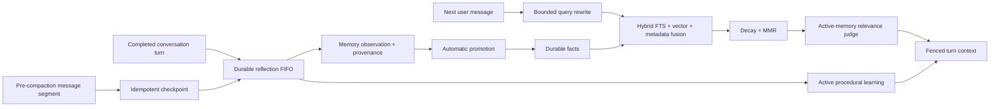

# Ares Memory V3

Memory V3 turns Ares memory into one automatic, durable feedback loop. It is
implemented on the existing local SQLite database and keeps reflection off the
foreground response path.

## Runtime flow



The durable reflection queue is the only automatic capture path. The older
session-end extractor remains available for compatibility but is disabled by
default through `memory.capture.legacy_extractor_enabled=false`.

## Automatic capture

Every completed root conversation turn can produce:

- observations with the source conversation, reflection, message, evidence,
  confidence, importance, project, tags, and timestamps;
- durable memories linked back to their source candidate;
- goals, commitments, follow-ups, and profile changes through the existing
  reflection applier;
- reusable workflow, style, pitfall, and technique learnings.

There is no memory content-policy gate and no approval queue. An observation is
promoted automatically, and a procedural learning becomes active immediately.
The score is retained as an explanation, not a write barrier. This follows the
requested operating mode while preserving revision history, provenance,
archive/restore, and promotion events for diagnosis and correction.

Procedural learnings do not rewrite executable skill files. They live in the
SQLite `self_improvement_candidates` table with `active` or `archived` state and
are retrieved into `<ares_learned_procedures>` when relevant. Repeated lessons
reinforce one record instead of creating an approval backlog.

## Pre-compaction checkpoint

Before context compaction discards a middle message segment, Ares hashes the
scope and normalized content and records that hash in
`memory_compaction_checkpoints`. The same segment can be queued only once. Its
reflection job uses the normal per-conversation FIFO, survives restart, and is
processed asynchronously. Checkpoint failures never stop compaction or the
active reply.

This is adapted from the checkpoint/hook invariants in next-sep/OpenClaw:
capture before lossy compaction, deduplicate against the current compaction,
and let post-processing fail open.

## Retrieval V3

Normal root-agent turns use a single asynchronous recall pipeline:

1. Rewrite referential messages such as “continue that project” into a concise
   retrieval query. The rewrite is cached, capped at 240 characters, bounded by
   a timeout, and falls back to the original text.
2. Retrieve bounded vector and FTS candidates and normalize each ranking before
   weighted fusion. Metadata relevance contributes alongside semantic and
   keyword relevance.
3. Apply category-aware time decay. Identity and durable facts decay slowly;
   ordinary notes decay faster.
4. Apply maximal marginal relevance to reduce near-duplicate context.
5. Ask the active-memory judge to select only supplied fact IDs. A timeout,
   malformed response, or unknown ID yields no injected memory and never blocks
   the main response.
6. Fence selected text inside `<ares_memory_context>` before model injection.

The last retrieval exposes the original/rewritten query, candidate count,
selected IDs, ranking mode, component scores, judge result, fallback reason,
and timings. Use `/memory explain` to inspect it.

## Schema additions and migration

MemoryStore adds `archived_at` and `source_candidate_id` to `facts_meta` and
creates these local tables when absent:

- `memory_observations`
- `memory_candidates`
- `memory_candidate_observations`
- `memory_candidate_queries`
- `memory_promotion_events`
- `memory_compaction_checkpoints`
- `self_improvement_candidates`

Migrations are additive and run through `CREATE TABLE IF NOT EXISTS` and
idempotent column checks. Existing fact IDs and content remain intact. Old
review-queue procedural records are converted to `active` during migration.

Cleanup now prefers archival over deletion. `archive()` and `restore()` take
revision snapshots and preserve FTS/vector data so a decision can be reversed.
Explicit `delete_memory` and `/memory delete` remain available when permanent
removal is actually intended.

## Configuration

```yaml
memory:
  enabled: true
  capture:
    legacy_extractor_enabled: false
    explicit_remember_fast_path: true
  retrieval:
    query_rewrite_enabled: true
    active_judge_enabled: true
    vector_weight: 0.55
    keyword_weight: 0.30
    metadata_weight: 0.15
    mmr_enabled: true
    mmr_lambda: 0.70
    temporal_decay_enabled: true
    max_candidates: 40
    max_injected: 5
    timeout_seconds: 5
  promotion:
    enabled: true
    min_occurrences: 2
    min_unique_sessions: 2
    reference_score: 0.72
  self_improvement:
    enabled: true
    max_active: 100
```

## Operations

| Command | Result |
|---|---|
| `/memory` | Recent non-archived durable facts |
| `/memory search QUERY` | Hybrid local search |
| `/memory learning` | Active automatic procedural learnings |
| `/memory explain` | Last retrieval diagnostics |
| `/memory archive ID` | Reversibly remove a fact from retrieval |
| `/memory restore ID` | Restore an archived fact |
| `/memory clean` | Merge duplicates and archive stale low-value facts |
| `/memory delete ID` | Permanently delete a fact |

## Verification

`tests/test_memory_v3.py` uses production `MemoryStore`, hash embeddings, real
SQLite files, real lifecycle/reflection stores, restart-safe queues, and an
explicit pre-V3 schema. It covers automatic low-confidence/unfenced capture,
immediate procedural learning, end-to-end reflection, idempotent compaction,
and archive/restore after migration. The broader memory, reflection, context,
agent, server, CLI, and full test suites remain regression coverage.
