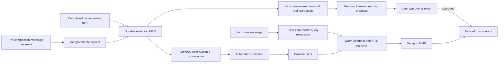

# Ares Memory V3

Memory V3 turns Ares memory into one automatic, durable feedback loop. It is
implemented on the existing local SQLite database and keeps reflection off the
foreground response path.

## Runtime flow



The durable reflection queue is the only automatic capture path. The older
session-end extractor remains available for compatibility but is disabled by
default through `memory.capture.legacy_extractor_enabled=false`.

## Automatic capture

Every completed root conversation turn can produce:

- observations with the source conversation, reflection, message, evidence,
  confidence, importance, project, tags, and timestamps;
- durable memories linked back to their source candidate;
- goals, commitments, follow-ups, and profile changes through the existing
  reflection applier;
- reusable workflow, style, pitfall, and technique learnings.

Durable factual observations still promote automatically. Procedural changes
use the Hermes review workflow: reflection stages a `pending_approval` proposal,
and only an explicit approval makes it active. Rejection retains the evidence
for audit without injecting the procedure into later turns.

Procedural learnings do not rewrite executable skill files. They live in the
SQLite `self_improvement_candidates` table with `pending_approval`, `active`,
`rejected`, or `archived` state. Only active records are retrieved into
`<ares_learned_procedures>`. Repeated evidence reinforces the same proposal.

Each reflection receives a bounded `ACTUAL_OUTCOMES` payload assembled from
real tool results and the turn execution record. Its auditable outcome review
labels the run `succeeded`, `partially_succeeded`, `failed`, or `unknown` and
derives learning from observed results rather than assistant claims.

## Pre-compaction checkpoint

Before context compaction discards a middle message segment, Ares hashes the
scope and normalized content and records that hash in
`memory_compaction_checkpoints`. The same segment can be queued only once. Its
reflection job uses the normal per-conversation FIFO, survives restart, and is
processed asynchronously. Checkpoint failures never stop compaction or the
active reply.

This is adapted from the checkpoint/hook invariants in next-sep/OpenClaw:
capture before lossy compaction, deduplicate against the current compaction,
and let post-processing fail open.

## Retrieval V3

Normal root-agent turns use a local fast recall pipeline:

1. Expand conversational terms and referential messages such as “continue that
   project” into a permissive local FTS query. This performs zero model calls.
2. Retrieve bounded FTS candidates immediately. After the first completed reply,
   the embedding model warms in a background thread; later turns can use vector
   and FTS candidates without paying model-startup time in the foreground.
3. Normalize each ranking before
   weighted fusion. Metadata relevance contributes alongside semantic and
   keyword relevance.
4. Apply category-aware time decay. Identity and durable facts decay slowly;
   ordinary notes decay faster.
5. Select the bounded top-ranked facts locally and fence them inside
   `<ares_memory_context>` before model injection.

The legacy model rewrite and active-memory judge remain available only through
`foreground_model_calls_enabled=true`; the low-latency default is false.

The last retrieval exposes the original/rewritten query, candidate count,
selected IDs, ranking mode, component scores, local selection result, embedding
warm-up state, foreground model-call count, fallback reason, and timings. Use
`/memory explain` to inspect it.

Background reflection follows foreground priority. Starting a new message
cancels and durably requeues any in-flight review; it resumes after reply
delivery and a short idle delay. A slow review therefore cannot occupy the
provider ahead of the user's next message.

Root tool schemas are also selected per current-turn intent. A casual message
such as “hey” sends zero tool schemas instead of the complete local/MCP catalog;
an action request receives only its relevant categories. This is request-size
routing, not an execution authorization boundary, and substantially reduces
provider prompt parsing on ordinary messages.

## Schema additions and migration

MemoryStore adds `archived_at` and `source_candidate_id` to `facts_meta` and
creates these local tables when absent:

- `memory_observations`
- `memory_candidates`
- `memory_candidate_observations`
- `memory_candidate_queries`
- `memory_promotion_events`
- `memory_compaction_checkpoints`
- `self_improvement_candidates`

Migrations are additive and run through `CREATE TABLE IF NOT EXISTS` and
idempotent column checks. Existing fact IDs and content remain intact. Legacy
`approved` procedural records migrate to `active`; existing pending proposals
remain pending.

Cleanup now prefers archival over deletion. `archive()` and `restore()` take
revision snapshots and preserve FTS/vector data so a decision can be reversed.
Explicit `delete_memory` and `/memory delete` remain available when permanent
removal is actually intended.

## Configuration

```yaml
model: big-pickle
fast_conversation_enabled: true
fast_conversation_model: deepseek-v4-flash-free
memory:
  enabled: true
  capture:
    legacy_extractor_enabled: false
    explicit_remember_fast_path: true
  retrieval:
    query_rewrite_enabled: true
    active_judge_enabled: true
    foreground_model_calls_enabled: false
    background_embedding_warmup: true
    vector_weight: 0.55
    keyword_weight: 0.30
    metadata_weight: 0.15
    mmr_enabled: true
    mmr_lambda: 0.70
    temporal_decay_enabled: true
    max_candidates: 40
    max_injected: 5
    timeout_seconds: 5
  promotion:
    enabled: true
    min_occurrences: 2
    min_unique_sessions: 2
    reference_score: 0.72
  self_improvement:
    enabled: true
    approval_required: true
    max_active: 100
reflection:
  model: deepseek-v4-flash-free
  idle_delay_seconds: 0.35
```

The conversation fast model applies only to tool-free `conversation` turns. Code, files,
research, external actions, goals, and delegated work continue using the
user-selected primary `model`. The fast lane is skipped automatically when its
provider does not match the active provider, and can be disabled without a
migration. If the fast model is unavailable before output starts, the request
falls back to the primary model automatically.

Outcome reflection independently uses `reflection.model`. It is tool-free,
background-only, provider-compatible, and has the same primary-model fallback.

## Operations

| Command | Result |
|---|---|
| `/memory` | Recent non-archived durable facts |
| `/memory search QUERY` | Hybrid local search |
| `/memory learning` | Approved procedural learnings |
| `/memory learning pending` | Hermes proposals awaiting review |
| `/memory learning approve ID` | Activate one reviewed proposal |
| `/memory learning reject ID` | Reject one proposal but retain its evidence |
| `list_learning_reviews` | Let any Ares chat surface inspect proposals and evidence |
| `review_learning` | Approve/reject a named proposal after an explicit user decision |
| `/memory explain` | Last retrieval diagnostics |
| `/latency` | Latest end-to-end, context, provider TTFT, model, and schema-count timing |
| `/memory archive ID` | Reversibly remove a fact from retrieval |
| `/memory restore ID` | Restore an archived fact |
| `/memory clean` | Merge duplicates and archive stale low-value facts |
| `/memory delete ID` | Permanently delete a fact |

## Verification

Measured on the configured local runtime during implementation (provider time
will vary):

- 100 cold/local recall runs: 0 model calls, 0.55 ms median, 1.02 ms p95;
- ordinary schema payload: 158 tools / 108,649 JSON bytes before, 0 tools for
  “hey” after;
- real tool-free provider turn with `big-pickle`: 6.50 s visible TTFT before;
- the same Ares path through `deepseek-v4-flash-free`: 2.56 s visible TTFT
  after, with the primary model unchanged for substantive work.

`tests/test_memory_v3.py` uses production `MemoryStore`, hash embeddings, real
SQLite files, real lifecycle/reflection stores, restart-safe queues, and an
explicit pre-V3 schema. It covers automatic factual capture, reviewed
procedural learning, real-outcome reflection, zero-model foreground recall,
idempotent compaction, and archive/restore after migration. The broader memory, reflection, context,
agent, server, CLI, and full test suites remain regression coverage.
