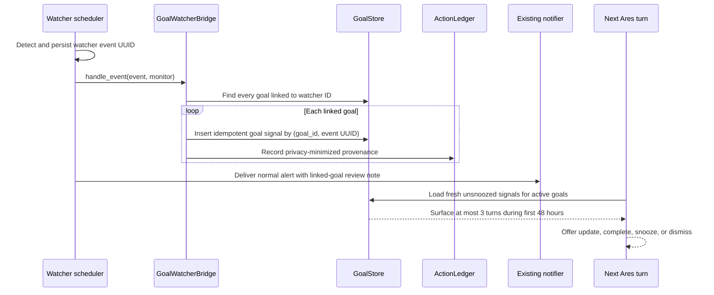

# Goal ↔ Watcher Integration

This document describes the implemented bridge between Ares durable goals and the proactive watcher engine.

## Contract

- Goals own intent: what outcome the user wants and why.
- Tasks own execution: the ordered work that advances an outcome.
- Watchers own observation: changing external or local conditions.
- A watcher event is evidence to review. It never changes goal progress or status by itself.

## Runtime flow



The integration hook runs for content/threshold changes and operational auto-pause incidents. Fan-out failure is logged but cannot break watcher persistence or the scheduler loop.

## Persistence

`goal_links` accepts `link_type='watcher'`. One watcher may link to many goals and one goal may link to many watchers.

`goal_watcher_signals` records:

- stable goal, watcher, and source watcher-event IDs;
- event type, summary, severity, old value, and new value;
- created, snoozed, surfaced, acknowledged, and resolution timestamps/state;
- bounded metadata such as watcher name/type;
- a unique `(goal_id, source_event_id)` index for replay-safe fan-out.

Early versions of the smaller plan-only signal table are migrated in place without deleting rows. Goal export format v4 includes watcher links and signal history; import restores both.

## Review and anti-nag behavior

Fresh, unsnoozed signals are attached only to active goals already selected for context. A signal is automatically shown for at most three actual rendered turns and only during its first 48 hours. It remains queryable indefinitely through `get_goal_signals`, `get_goal_status`, or `/goals signals`.

Surface counts increment only when the final blended model context contains the signal, so token-budget truncation does not consume a turn.

## Resolution

- `snooze_goal_signal` hides a signal until an ISO timestamp or bounded number of hours.
- `acknowledge_goal_signal` records reviewed/dismissed without changing the goal.
- `update_goal(resolves_signal_id=...)` updates the goal and acknowledges its signal in one goal-database transaction.
- `complete_goal(resolves_signal_id=...)` completes the goal and acknowledges its signal in one goal-database transaction.

After every goal-specific copy of a source event is resolved, the tool layer acknowledges the watcher incident. This preserves correct fan-out semantics when one watcher supports several goals.

## Setup examples

Natural language:

```text
Track a goal to buy a laptop under $1,000, then watch this product page and link it.
```

Model tools:

```text
create_goal(title="Buy a laptop under $1,000")
create_watcher(name="Laptop price", url="https://shop.example/laptop", goal_id=12)
run_watcher_now(watcher_id="...")
```

Terminal:

```text
/monitor add "Laptop price" https://shop.example/laptop --interval 15m --goal 12
/monitor status WATCHER_ID
/goals show 12
/goals signals 12
```

The first successful watcher run establishes a baseline. Later differences create incidents and linked goal signals.

## Verification coverage

Automated tests cover schema migration, lifecycle and idempotency, multi-goal fan-out, operational auto-pause fan-out, no implicit goal mutation, three-turn anti-nag behavior, snoozing, transactional resolution, source-event reconciliation, watcher create/delete link cleanup, CLI linking, action provenance, prompt/context rendering, and export/import round trips.
