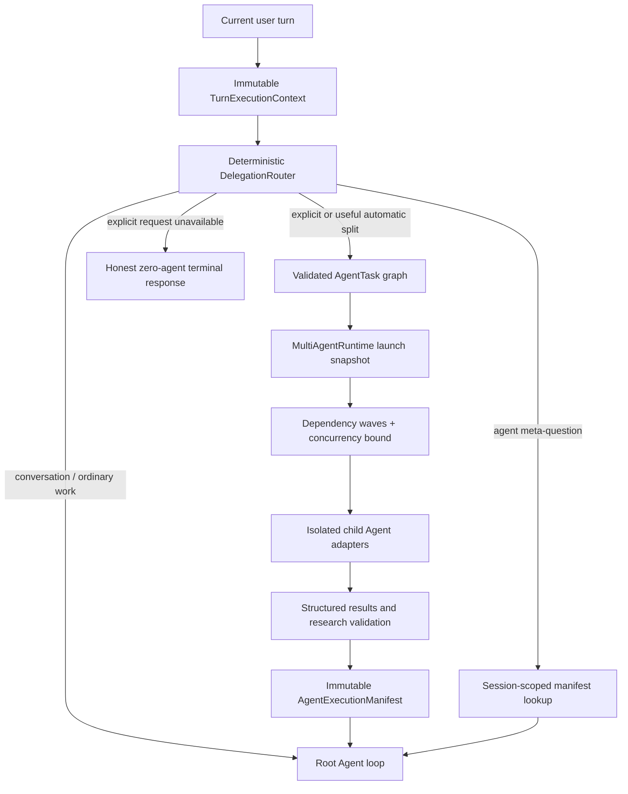

# Multi-agent architecture

This document is the developer contract for Ares’ native supervisor. The operator-facing behavior and complete configuration reference are in [Native multi-agent mode](multi-agent.md).

## Non-negotiable invariants

1. The current user turn is the only ambient authority. History is context, never permission.
2. An explicit request for agents either launches native child runs or reports why zero agents ran.
3. Parallel tool calls and durable workflows never increment the agent count.
4. Every child has a unique run ID, unique session ID, bounded context, tool allowlist, and capability set.
5. Consequential child actions require an exact root-issued, expiring, single-use grant.
6. All root/child access to shared mutable resources passes through one root-owned coordinator.
7. A manifest is the sole authority for counts, roles, waves, tools, artifacts, status, and timing.
8. Manifest reads, events, artifacts, and cancellation are scoped to the owning conversation/chat session.
9. Source-backed research preserves URLs, evidence, conditions, uncertainty, and disagreement through synthesis.
10. Disabled, failed, timed-out, blocked, cancelled, and partial runs remain visible and are never described as full success.

## Request path



Explicit/native and meta routes are prepared before the general model loop. When a native plan runs, the root’s ordinary tool schemas are withheld for that preparation step, so the model cannot replace the team with `create_task` or another mechanism. Verified manifest JSON is inserted as a system evidence block for final synthesis.

## Component ownership

| Module | Responsibility |
|---|---|
| `ares.turn_policy` | Current-turn intent, tool effects, root confirmation grants, and immediate authorization |
| `ares.delegation_router` | Deterministic explicit/automatic/meta/no-delegation decision and bounded plan |
| `ares.multi_agent` | Typed specs, tasks, results, manifests, graph validation, dependency-wave orchestrator |
| `ares.multi_agent_runtime` | Root-owned registry, launch snapshots, IDs, limits, reviews, persistence, events, cancellation, config reconciliation |
| `ares.multi_agent_adapter` | One isolated Ares child loop per task, bounded prompt/context, tool filter/authorizer, result normalization |
| `ares.multi_agent_policy` | Tool/resource classification, child capabilities, action grants, path checks, tool-call waves |
| `ares.multi_agent_resources` | Cross-agent locks, filesystem leases, provider semaphore, builder worktree/fallback serialization |
| `ares.multi_agent_research` | Structured claims, evidence validation, contradiction detection, synthesis confidence ceiling |
| `ares.multi_agent_store` | Bounded SQLite root/child records, manifests, checkpoints, session-scoped query, retention |
| `ares.tools.definitions`, `ares.tool_registry` | Root-visible JSON schemas and dynamic per-turn selection for delegation/run introspection |
| `ares.server`, CLI, Telegram | Session-scoped presentation, commands, events, artifacts, and cancellation |

The root `Agent` owns one `MultiAgentRuntime`. Children receive the runtime’s safe shared collaborators but do not own another runtime unless recursion is explicitly enabled and within depth policy.

## Current-turn authorization boundary

`Agent.run()` and `Agent.run_stream()` create a fresh `TurnExecutionContext` containing the current input, request/session/root/child IDs, derived intent/targets, and exact confirmation grants. A `ContextVar` carries it through the turn. The context is immutable.

`authorize_turn_tool()` classifies each tool as read-only, delegation, local mutation, workflow mutation, browser interaction, or external action. It authorizes against the current intent immediately before execution. The root model cannot gain authority because an older user message requested an edit, because an older assistant promised to continue, or because a model emitted a confirmation field.

The message builder places a `Current Turn Guard` after historical messages. This is defense in depth; the runtime authorizer, not the prompt, is the security boundary. Greetings/thanks are conversation turns and permit no tool. Agent meta-questions permit only agent-introspection tools. Continuation language permits bounded state lookup but not replay of a prior action.

## Delegation decision semantics

`DelegationRouter.route()` has four modes:

- `EXPLICIT`: a current-turn native-agent phrase was found. Availability, roles, task limits, and plan construction are checked. Failure returns a typed `DelegationFailureReason` and an honest message.
- `AUTO`: no explicit phrase was found, but the current turn contains meaningful independent workstreams or implementation/review structure. Plans with fewer than two useful tasks are discarded.
- `META`: the user asks about or manages agent runs. No new team is allowed.
- `NONE`: no deterministic delegation benefit exists.

The router does not consult conversation history. It recognizes named roles, requested counts, independently named tracks, builder/reviewer dependencies, and requested synthesis. Track order becomes task order; dependencies become deterministic execution waves.

Runtime/provider/timeout/authorization exceptions are normalized into typed failed decisions. Explicit failure is terminal for that request. Automatic failure can return to normal root handling, but verified evidence states that zero agents ran.

## Task graph and launch snapshot

`AgentTask` is immutable and includes task ID, role, bounded prompt, dependencies, task context, timeout, required flag, result format, allowed optional context categories, and partial-dependency policy. `validate_task_graph()` rejects duplicate IDs, missing dependencies, self-dependencies, and cycles before a child starts.

`MultiAgentRuntime.delegate()` then:

1. checks enabled state, task/depth limits, and recursive-delegation policy;
2. adds a dependent reviewer for each mutation-capable task when required;
3. allocates the root/request IDs plus unique child run/session IDs;
4. prepares builder workspaces;
5. snapshots configured roles and divides the total iteration budget across the submitted children;
6. persists queued root/child records;
7. starts `MultiAgentOrchestrator` with the snapshotted registry, concurrency bound, total deadline, progress callback, and run metadata.

Hot configuration changes do not rewrite an active snapshot.

The orchestrator repeatedly selects all ready tasks in submission order, records that tuple as one wave, and runs it through an `asyncio.TaskGroup` plus semaphore. Results are placed back in submission order. A failed dependency creates a recorded `blocked` result unless the dependent explicitly allows partial inputs. There is no hidden “best effort succeeded” state.

## Child identity and bounded context

Child IDs have the form `agent:<root-run>:<task-id>:<child-run>` for sessions, while run IDs are independently allocated. The parent session remains separate and is stored on each child record. The adapter enters the child session scope and calls the child with an empty conversation history.

The specialist system prompt contains only:

- role description and instructions;
- safety contract;
- root, parent, and child run IDs;
- result format and context mode;
- explicitly allowed optional context category names;
- bounded shared constraints;
- task-specific context;
- results from declared dependencies;
- the bounded assignment.

`ContextMode.BOUNDED_SPECIALIST` suppresses profile, soul, global memory retrieval, root conversation history, automatic skill index/context, and root `last_messages`. Selected project files can be passed only in bounded task context under an explicit `project_files` policy; task wording cannot infer that permission. A bounded child sees live readiness only for MCP servers backing schemas already visible to that child. Children use separate messages, model client, timeout, and iteration state, and closing a child does not close root-owned stores/executors.

## Child tool security

`AgentSpec.allowed_tools` controls names or wildcard patterns. `AgentSpec.capabilities` independently controls effects. Both are applied before model exposure and again before execution.

The default read-only roles receive filesystem/browser/database read capabilities only. The builder receives bounded filesystem write, code, shell, and database-write capabilities. Communication, browser interaction, external mutation, and delegation are not implied by `can_mutate`.

The authorizer additionally rejects:

- child-originated confirmation flags;
- file access outside the assigned builder workspace;
- shell/REPL calls without an explicit workspace `cwd`;
- opaque nested interpreters and path traversal/change-directory escapes;
- recursion without both role and runtime authorization;
- consequential actions without a valid action grant.

### Action-grant protocol

The root registry issues a grant only with `explicit_user_confirmation=true`. Its record binds:

```text
grant ID
root run ID
child run ID
request ID
tool name
SHA-256 of canonical tool + arguments
expiry
confirmed=true
```

Consumption is atomic and single-use. Any mismatch or expiry denies the call. All grants for a root are revoked on completion or cancellation. The opaque ID is insufficient on its own because the runtime recomputes every binding.

## Shared-resource scheduler

The same `ResourceCoordinator` instance is injected into root and child agents. File resources use path-aware reader/writer leases: read/read can overlap; any overlap containing a write cannot. Missing/unknown paths conflict conservatively with writes.

Stateful locks cover browser, shell, REPL, database writes, communication, external mutation, and delegation. Shell/REPL are treated as unknown-scope filesystem writes and also reserve database, communication, and external state because unstructured code can reach any of them. This policy sacrifices some concurrency to avoid cross-child races. MCP calls can also share an optional provider semaphore.

Tool-call results retain original model order even when safe calls execute concurrently. A failing tool call does not erase independent results.

### Builder workspace policy

For multiple mutation tasks, `BuilderWorktreeManager.prepare()` attempts detached worktrees under `builder_worktree_root`. It refuses isolation and returns a reason when Git is absent, the working tree is dirty/not Git, the target is unsafe/invalid, or worktree creation fails. A single builder is assigned the live repository only through the serialized fallback.

Every mutation-capable adapter enters `mutation_slot()` around its child loop. Isolated worktrees may run concurrently; every non-isolated/live-tree builder shares one lock and therefore serializes. Tool arguments are resolved under the assigned workspace and escape is denied.

Worktrees are execution isolation, not merge authorization. No child may silently merge into the live tree. The adapter captures isolated changes as a patch artifact; a dependent reviewer must emit an explicit `APPROVE_PATCH` marker before the root applies the patch sequentially, and only while the live repository is still clean. Rejected/conflicting patches remain artifacts for manual review.

## Research evidence contract

`ResearchClaim` normalizes a claim, source URLs, supporting evidence, confidence, caveats, publication dates, and benchmark conditions. Validation rejects malformed/publicly unusable URLs and flags missing sources/evidence. Exact figures require visible source evidence; benchmark/throughput figures additionally require conditions. Unstructured exact numeric prose without a URL is also flagged.

The adapter stores validation output in child metadata for researcher, synthesizer, and reviewer roles. `conflicting_claims()` surfaces simple positive/negative contradictions, and `synthesis_confidence()` prevents a proposed synthesis confidence from exceeding the strongest input claim. Root evidence instructions require citations, caveats, conditions, and conflicts to survive final synthesis.

Validation records are not a web-truth oracle: a syntactically valid URL is still evidence the root/reviewer must assess. The runtime never browses merely to answer how many agents ran.

## Manifest and store contract

The runtime creates `AgentExecutionManifest` after child terminal results are assembled. `agent_count` is computed, never model-authored. Child entries retain IDs, role, sessions, dependencies, status, timing, tool names, artifacts, errors, iterations, and metadata. The root entry retains request/session IDs, status, waves, timing, partial-result flag, and builder workspaces.

The SQLite store keeps one root row plus child rows. Root `manifest_json` is the durable truth object; bounded result content and artifact references support inspection without embedding large files. The launch plan and checkpoint list completed/remaining terminal task IDs. On restart, orphaned queued/running records become `interrupted`; session-owned resume reuses only successful read-only child results and rejects unsafe unfinished mutation work.

When persistence is disabled, the same records live in the runtime’s volatile map for the process lifetime. APIs expose the same shape.

## Session and surface boundary

`get_run`, `list_runs`, `get_latest_run`, and `cancel` accept a session. A record is visible only when that session matches its root session or a child’s parent/child session. Latest lookup refuses an empty/global session.

Surface normalization is stable:

- CLI: the current Ares session ID;
- workspace: `conversation-<id>` for numeric conversation IDs;
- Telegram: `telegram-<chat/session-id>`.

The server stores selected conversation per WebSocket connection. It filters run snapshots/events and resolves artifact paths only from that conversation’s records. Telegram subscribes with its normalized chat session. A cancellation request is rejected if the run is foreign, absent, or already terminal.

Stable events include orchestration start/completion/cancellation; agent queue/start/progress/completion/failure/timeout/block/cancel; tool start/progress/completion; and synthesis start. Every event carries root/run/request/session identity needed for filtering.

## Configuration reconciliation

`MultiAgentRuntime.apply_config()` first builds a candidate role registry. If validation succeeds, it swaps future-run policy atomically. Active runs retain their launch registry, budgets, and coordinator.

- `enabled=false` rejects new delegation immediately.
- Active runs drain unless `cancel_active_on_disable=true`.
- Persistence/data-directory topology cannot change while a run is active.
- Provider-semaphore changes wait until active runs drain.
- Worktree manager/path and retention policy refresh safely.
- Turning persistence off closes the old store only after topology checks pass.

The root refreshes tool schemas after configuration changes. Delegation schemas are visible only when native mode is enabled; children never receive them unless recursion is deliberately configured.

## Terminal states and retry rules

The canonical child states are `succeeded`, `failed`, `timed_out`, `blocked`, and `cancelled`. Root status derives from child results and never upgrades a failed required task to success. Partial success is recorded explicitly in manifest metadata.

Only a provider/transport failure before any tool started can become `RetryableAgentError(retry_safe=true)`. Retry count and exponential backoff are bounded, total deadline still applies, and role fallback models are selected only for later attempts. Once a consequential call may have started, the orchestrator does not retry by inference.

Cancellation propagates from the root task, marks queued/running records cancelled, emits terminal events, clears the active map, and revokes grants. Cleanup and provider-limit reconciliation run in `finally` paths.

## Extending the supervisor safely

When adding or changing a role:

1. Write one bounded responsibility and explicit non-responsibilities.
2. Start with no tools; add the smallest allowlist.
3. Add only the capabilities required by those tools.
4. Keep communication, external mutation, browser interaction, and delegation absent unless a reviewed grant path exists.
5. Choose bounded iteration/timeout/retry values and retry-safe provider behavior.
6. Decide whether mutation requires an injected reviewer.
7. Add graph, authorization, context-isolation, resource-conflict, manifest, session, failure, and cancellation tests.
8. Extend `python -m ares.multi_agent_smoke` only with deterministic fake output—never live providers.

## Verification seams

The offline smoke module deliberately composes production primitives rather than mocking their decisions:

- turn context + immediate authorization for scenario A;
- router + orchestrator + structured research + manifest for B;
- SQLite store + meta authorization for C;
- typed disabled route for D;
- orchestrator + shared resource coordinator + dependent reviewer for E.

Run it independently of configured credentials:

```bash
python -m ares.multi_agent_smoke
python -m pytest -q -p no:cacheprovider tests/test_multi_agent_smoke.py
```

Use `/agents doctor` for local runtime/store/config diagnostics and `/agents smoke-test` only when intentionally validating two real configured specialist model calls.
