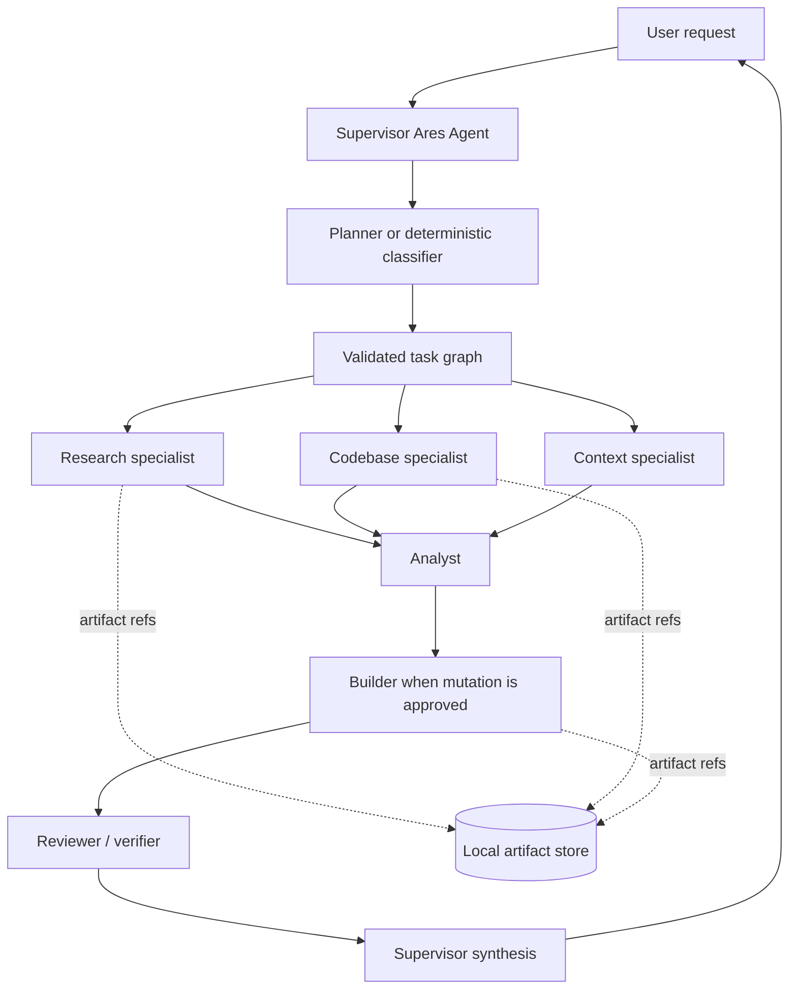

# Ares Native Multi-Agent Runtime

**Date:** 2026-07-14  
**Status:** Phase 1 implementation  
**Branch:** `agent/multi-agent-runtime`

## Decision

Ares should add multi-agent orchestration as a native runtime layer instead of making CrewAI, AutoGen, or LangGraph a core dependency.

Ares already owns the important primitives: an OpenAI-compatible model client, local memory, skills, MCP tools, action provenance, task workflows, watchers, session isolation, streaming progress, and explicit confirmation boundaries. Replacing that runtime would duplicate state and make local-first safety harder to reason about.

The chosen architecture is a **manager/supervisor with bounded specialists**:

1. One user-facing supervisor owns the conversation and final answer.
2. The supervisor delegates bounded tasks to named specialists.
3. Independent tasks run in parallel.
4. Dependent tasks run in deterministic waves.
5. Specialists receive strict tool allowlists.
6. Mutation-capable work is separated from research and review.
7. Large outputs are stored as durable artifacts and returned by reference.
8. A reviewer checks consequential results before they are presented or applied.

This is the manager-owned “agents as tools” pattern, not unrestricted peer-to-peer agent chat.

## Why this fits the current Ares runtime

The existing `Agent` already:

- isolates concurrent sessions with `ContextVar` scopes;
- shares one tool plane across CLI, workspace, voice, Telegram, watchers, and MCP;
- serializes the shared Playwright browser surface;
- preserves local memory and action provenance;
- runs an iterative model/tool loop.

The missing primitive is an orchestration layer above that loop. Also, `process_tool_calls_async()` currently executes returned tool calls one-by-one, so real parallelism needs explicit resource-aware scheduling rather than only prompting the model to work in parallel.

## Phase 1 included here

`ares/multi_agent.py` adds:

- `AgentSpec`: specialist identity, instructions, model override, iteration budget, timeout, delegation flag, mutation flag, and tool allowlist.
- `AgentTask`: task id, specialist, prompt, dependencies, local context, timeout override, and required/optional status.
- `AgentRegistry`: stable named specialist registry with per-run snapshots.
- `MultiAgentOrchestrator`: dependency-aware scheduler using Python 3.11 `asyncio.TaskGroup`, `asyncio.Semaphore`, and `asyncio.timeout`.
- `AgentResult` and `AgentTeamResult`: normalized deterministic outcomes.
- `AgentArtifact`: lightweight references to durable specialist output.
- `AgentProgressEvent`: structured lifecycle events for CLI, workspace, Telegram, and logs.
- Conservative built-in roles: planner, researcher, analyst, builder, reviewer, and synthesizer.

### Execution guarantees

- All ready tasks are scheduled together.
- A semaphore bounds active specialists.
- A task starts only after every dependency finishes.
- One specialist exception becomes a failed result instead of crashing siblings.
- Each specialist has a hard timeout.
- Results are returned in original task order.
- Failed dependencies block downstream tasks.
- Optional fail-fast mode cancels remaining required work.
- Dependency results and run metadata are immutable snapshots.

## Default capability boundaries

| Agent | Purpose | Mutation |
|---|---|---:|
| planner | Create a minimal dependency-aware plan | No |
| researcher | Collect current source-backed evidence | No |
| analyst | Compare evidence and identify trade-offs | No |
| builder | Implement an approved scoped change | Yes |
| reviewer | Independently inspect correctness and safety | No |
| synthesizer | Combine results into the final response | No |

The builder is the only initial role with filesystem and shell mutation tools. Researcher and reviewer roles are read-only.

## Proposed runtime flow



## Phase 2: connect the existing `Agent` as the executor

Add an adapter that creates an isolated specialist run while reusing Ares services:

- same `MemoryStore`, `ConversationStore`, MCP manager, skills, action ledger, and session store;
- separate model history for every specialist;
- tools filtered from `AgentSpec.allowed_tools` before schemas reach the model;
- separate iteration, timeout, task-count, and token budgets;
- parent/child run ids recorded in action provenance;
- no direct user-facing response from a specialist;
- no memory writes unless explicitly allowed;
- cancellation propagated when the parent turn ends.

Expose bounded supervisor tools:

- `list_agents`
- `delegate_task`
- `delegate_tasks_parallel`
- `get_agent_run`
- `cancel_agent_run`

Recommended defaults:

```json
{
  "multi_agent": {
    "enabled": false,
    "max_parallel": 4,
    "max_tasks_per_run": 8,
    "max_delegation_depth": 1,
    "default_timeout_seconds": 120,
    "require_review_for_mutations": true
  }
}
```

## Phase 3: parallelize safe tool calls

Classify tool calls into resource groups before parallel execution:

- Playwright browser operations: serialized by the existing browser lock.
- Filesystem mutations on the same normalized path: serialized per path.
- Shared REPL operations: serialized per REPL session.
- Read-only web, MCP, and file calls: concurrent.
- Consequential communication, deletion, or external mutation: confirmation-gated and serialized.

Preserve the model’s tool-result order even when execution finishes out of order. Do not blindly parallelize every tool call because two writes may conflict.

## Phase 4: persistence and workspace UI

Persist a run tree in SQLite:

- run id and parent run id;
- session id, task id, and specialist;
- status, timing, model, and usage;
- tool calls and action ids;
- artifact references;
- error summary and reviewer decision.

The workspace should show a compact live run tree with status, elapsed time, artifacts, failures, cancellation, and final synthesis. CLI and Telegram should show concise progress events rather than every specialist token.

## Safety and reliability rules

1. The supervisor remains the only owner of the user-facing answer.
2. Mutation tools are denied by default.
3. Tool access is filtered before the specialist model sees schemas.
4. Browser state remains serialized.
5. Dependency output is treated as untrusted data, not instructions.
6. Every run has time, iteration, task-count, and delegation-depth budgets.
7. Failed dependencies block downstream work.
8. Consequential actions retain Ares confirmation requirements.
9. Evaluate final state and artifacts, not only model narration.
10. Never auto-retry mutations unless the operation is proven idempotent.

## Research basis

- OpenAI Agents SDK: manager-owned agents-as-tools, handoffs, code-driven orchestration, and parallel agents for independent work.
- Python `asyncio`: `TaskGroup` structured concurrency, semaphores, and timeout contexts.
- Anthropic’s production multi-agent research system: parallel research benefits, coordination and state-consistency risks, context management, failure propagation, and durable artifact output.

## Validation

The focused tests cover actual parallel overlap, bounded concurrency, dependency waves, dependency-result delivery, exception isolation, blocked dependants, timeouts, fail-fast behavior, progress events, graph validation, and mutation-boundary separation.
